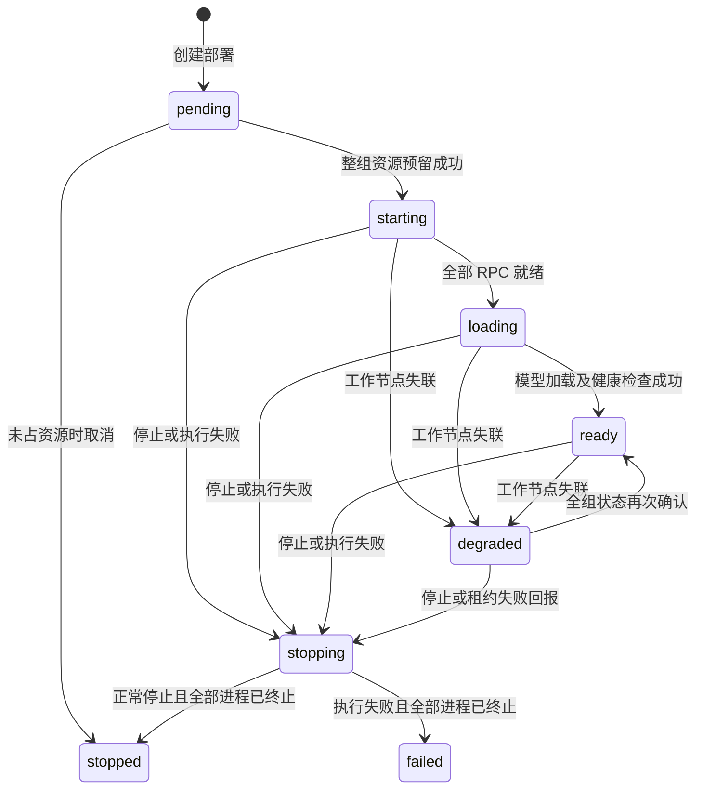

# 分布式推理与服务监控

本指南描述 2026-09-23 代码状态。当前范围是可信私网内的 2–8 台 NVIDIA 节点，每节点一张卡，用 llama.cpp RPC 共同承载一个 GGUF 模型。

## 调度和执行

控制面按以下条件筛选节点：管理员已启用、健康就绪、35 秒内收到心跳、没有现存任务或部署、配置了 Agent/RPC 地址、网络组一致、引擎版本一致、有足够空闲显存。重复注册的物理 GPU UUID 或 RPC 地址会被拒绝。

每张卡的权重容量估算为：`驱动上报空闲显存 - 运行预留 - KV 缓存预算`。选择容量充足的一组节点后，控制面在同一锁内校验并预留整组资源，失败不留下部分预留。首版为节点独占，其他卡暂时也不接受平台任务。平台无法阻止平台外程序占用显存，实际模型加载仍可能失败。

协调节点启动一个 llama-server，并通过 RPC 调用所有选中 GPU（包括自身 GPU 对应的 RPC 工作进程）。模型按层划分，tensor-split 按容量给出比例；它不是多个完整模型副本的负载均衡，也不是 NVLink 共享显存。协调进程禁用本地 CUDA，避免重复枚举同一张卡。所有 RPC 强制使用 TCP，确保流量经过计数代理。

CUDA 引擎固定源码版本 `e6ab7c1a41054a888ada952eab4c886444c2f5ad`。默认编译架构为 `75;80;86;89;120`，可通过 CUDA_ARCHITECTURES 缩小到目标卡架构。构建使用 CUDA 12.8.1；需在目标机验证驱动和 GPU 支持。当前尚未完成这个 CUDA 镜像的实际构建和推理验证。

## 部署生命周期



- Agent 默认每 5 秒同步资源、工作进程状态和监控；控制面每 5 秒核对部署。
- RPC 的初步就绪检查是 TCP 可连接，真正的协议兼容性和容量由 llama-server 加载确认。RPC 启动超时 2 分钟，模型加载超时 15 分钟。
- 任一工作节点状态不新鲜，网关拒绝新的推理请求。Agent 45 秒无法成功同步会停止当前执行。超时本身不会让控制面释放资源。
- 正常停止立即关闭新请求入口；协调节点最多等 30 秒排空在途请求，再停止模型和自身 RPC，其他节点收到确认后停止。执行失败则整组停止。
- 必须收到全部节点对应 assignment token 的进程停止确认，才释放资源。失联节点可能让部署保持 stopping；恢复该 Agent 才能核对。当前不提供危险的强制释放按钮。
- 同一次部署失败不会在 Agent 上悄悄重启。资源释放后重新创建部署，得到新的 token。
- 状态快照保存节点、任务、部署和预留。控制面重启后保留预留，将心跳置为待确认，重新握手前不接受推理。不要删除仍承载模型的控制面数据卷。只运行一个控制面写入者。

## 管理端部署

先构建 `web-console/dist`，复制 `deploy/compose/.env.example` 为本地 `.env`（不要提交真实令牌），设置 `CONTROL_PLANE_TOKEN` 和 `CONTROL_PLANE_BIND`。例如在项目根目录：

```bash
docker compose --env-file deploy/compose/.env -f deploy/compose/docker-compose.yml --profile observability up -d --build control-plane prometheus grafana loki cadvisor
```

远程 Agent 必须能访问管理地址。共享 Bearer token 覆盖 API、Agent 同步、日志和指标接口；healthz 不鉴权。原始 GPU RPC 不受该令牌保护，必须通过可信局域网/受控隧道及防火墙限制节点间访问。对不可信网络还需反向代理 TLS、独立节点认证和授权。

## 每台 GPU 节点部署

复制 `.env.distributed-agent.example` 为 `.env.distributed-agent`，修改：

| 配置 | 含义 |
|---|---|
| NODE_ID | 稳定且唯一的物理节点 ID |
| NODE_HOST | 其他节点和控制面可访问的私网 IP |
| CONTROL_PLANE_URL | 管理端地址 |
| CONTROL_PLANE_TOKEN | 与控制面相同的共享令牌 |
| NETWORK_GROUP | 同一部署所有节点使用相同组名 |
| MODEL_DIR | 主机 GGUF 文件目录，以只读方式挂载 |
| LLAMA_CPP_REF | 所有节点使用相同的固定源码版本 |
| CUDA_ARCHITECTURES | 目标卡的 CUDA 架构列表 |

```bash
docker compose --env-file deploy/compose/.env.distributed-agent -f deploy/compose/docker-compose.distributed-agent.yml up -d --build
```

开放给可信节点的端口是 Agent 9090 和 RPC 50052。实际模型端口 18081 和 RPC 后端 50053 只监听容器回环地址。每台物理机器运行一份 Agent；不要在管理端启动多份容器冒充多台机器。

模型文件必须已存在协调节点的 MODEL_DIR。指定协调节点可以避免自动选择到没有文件的主机；否则所有候选协调节点都应有该文件。填实际 GGUF 文件大小，文件大于声明预算会拒绝启动。协调节点还需要足够磁盘和系统内存；GPU 显存规划不代替主机内存规划。

## API

除 healthz/readyz，启用令牌后以下接口均需 `Authorization: Bearer <token>`。

| 方法与路径 | 功能 |
|---|---|
| POST /api/v1/deployments/preview | 只预览节点和拒绝原因，不预留 |
| POST /api/v1/deployments | 创建；使用稳定 idempotency_key 防止重试重复占卡 |
| GET /api/v1/deployments | 查询全部模型服务 |
| GET /api/v1/deployments/{id} | 查询生命周期和每个工作节点 |
| POST /api/v1/deployments/{id}/stop | 停止并等待全部进程确认 |
| POST /api/v1/deployments/{id}/inference/v1/chat/completions | OpenAI 风格聊天请求，支持 stream |
| POST /api/v1/agents/{node}/sync | Agent 上报和领取期望状态 |
| GET /api/v1/agents/{node}/logs | 当前 Agent 工作进程的有限日志尾部 |
| GET /api/v1/monitor/services | 服务状态、累计值、速率和最近 120 个采样 |
| GET /metrics | Prometheus 聚合指标，包含 GPU 显存和利用率 |

创建示例（容量仅为说明，必须按实际文件/设备填写）：

```json
{
  "name": "shared-model",
  "model_file": "model-Q4_K_M.gguf",
  "weight_mib": 12000,
  "reserve_mib": 1024,
  "kv_cache_mib": 1024,
  "context_size": 4096,
  "min_nodes": 2,
  "max_nodes": 3,
  "network_group": "lan-default",
  "coordinator_id": "gpu-node-01",
  "idempotency_key": "operator-chosen-stable-key"
}
```

## 监控口径

| 服务 | 健康来源 | 请求和流量来源 |
|---|---|---|
| 控制面 API / Web 控制台 | 当前控制面进程；快照失败降级，readyz 返回 503 | 实际 HTTP 完成请求、4xx/5xx、完整耗时、已读请求体和已写响应体 |
| Agent API / 控制连接 | Agent 心跳及同步结果 | 入站 API 与出站控制同步分别计数 |
| 每个 GPU RPC 进程 | 子进程存活 + TCP 就绪 | 透明 TCP 代理的双向载荷字节、活动连接、累计连接、后端连接失败 |
| 模型推理进程 | llama-server healthz/metrics 和子进程状态 | 推理 HTTP 请求、流量、错误、完整响应耗时；上游可用的 token/队列等指标 |
| 每个模型的统一网关 | 全部工作节点与模型就绪 | 用户请求数、错误、耗时和双向字节；模型总请求量以此层为准 |
| Prometheus/Grafana/Loki/cAdvisor 和可选基础设施 | 定时 HTTP/TCP 探测 | 对应 Compose 项目的容器网卡计数；业务请求量需各自专用 exporter |
| GPU | 新鲜 nvidia-smi 心跳 | 总/空闲显存、利用率；不支持的值保持缺失 |

HTTP/RPC 字节不含协议头和 TCP/IP/TLS 开销；容器流量是另一种口径，不应相加。同一请求经过网关、Agent 和模型多个边界，也不能将所有服务请求数相加当用户请求量。流式耗时是整个响应时长，尚无单独的首 token 延迟指标。HTTP 错误指 >=400；200 响应体内的应用错误不会自动识别。

页面约每 5 秒刷新，基础设施约每 10 秒采集，保留最近 120 个点；实际间隔取决于上报时间。重启会清空内存曲线，Prometheus 的持久化历史默认保留 15 天。缺少 cAdvisor 数据时显示“未采集”，不会用健康探测流量冒充服务总流量。容器指标按 Compose 项目隔离，Grafana 的容器面板可选择项目。

Compose 的 `infra` 和 `identity` profile 默认未启用；PostgreSQL、NATS、MinIO、Keycloak 因而显示离线/未启动，这是它们的实际部署状态。这些服务尚未接入业务持久化或身份认证。可通过 services.json 管理需要监控的端点。Loki 服务健康已检查，但日志尚未持续写入 Loki；当前只能查看 Agent 内存中的工作进程日志尾部。

Prometheus 规则覆盖控制面不可达、Agent 心跳超时、推理错误率和控制面高延迟。尚未配置 Alertmanager 或外部通知渠道，不会自动发消息。Grafana 仪表板包含状态、QPS、错误率、P95、收发速率、活动请求、心跳、token 速率、容器资源、RPC 连接和 GPU 指标。

## 本轮验证和后续硬件验收

已验证：Go 单元/集成测试、Linux race 检测、前端构建；Docker 控制面、Prometheus 三个 scrape target、Grafana 14 个面板和 cAdvisor 实际网卡数据；浏览器中监控、资源预览拒绝原因、节点详情；本机 RTX 5060 8151 MiB 的真实资源采集。

执行器测试通过独立测试进程提供 TCP/HTTP 端点，验证启动、退出、超时、停止和流式计数。它们没有执行真实模型。未验证：CUDA 镜像构建、两台及以上真实 GPU 上的模型加载/生成、网络吞吐和断网时模型进程行为、不同显卡组合。

实际多机验收应记录：至少两台独立主机和 GPU UUID；同版本 RPC 服务启动；模型在单卡容量不足时分布加载成功；每张卡显存/利用率；真实聊天输出及各服务流量；首 token、生成速度和加载耗时；停止/断网/恢复后的进程与资源归属。性能和最大模型规格以这些实测结果为准。

## 本次本地验证实例

使用 `resource-adjust-observe-check` 项目和 `docker-compose.review.yml` 避开原有端口，控制台 http://127.0.0.1:18090 ，Prometheus http://127.0.0.1:19090 ，Grafana http://127.0.0.1:13000/d/compute-services 。真实采集 Agent 是 observe-local-5060，原生 Windows 进程，未配置引擎且调度禁用；PID、监听端口和日志在 tmp/observe-agent.*。

停止监控实例（保留数据卷）：

```powershell
docker compose -p resource-adjust-observe-check -f deploy/compose/docker-compose.yml -f deploy/compose/docker-compose.review.yml --profile observability down
```

采集进程可通过任务管理器按 `observe-edge-agent.exe` 名称确认后停止。不要误停其他已有 Agent。重新启动可构建 edge-agent 后，使用 --node-id observe-local-5060 --runtime windows-native --control-plane http://127.0.0.1:18090 --listen 127.0.0.1:<空闲端口>。
