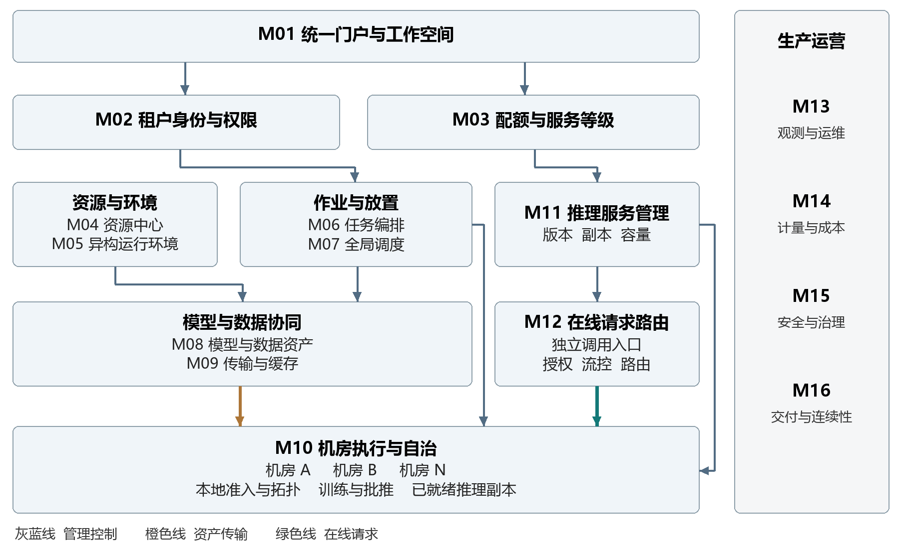
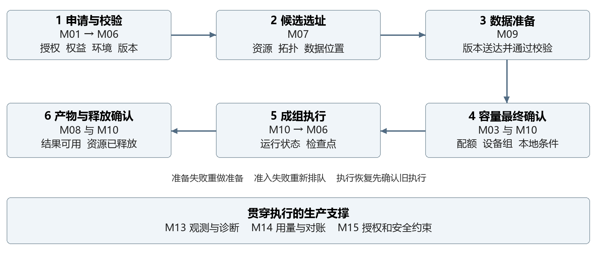
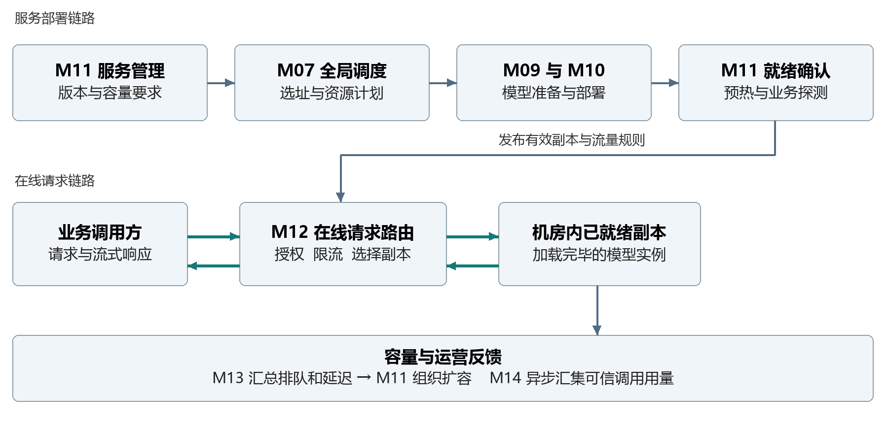
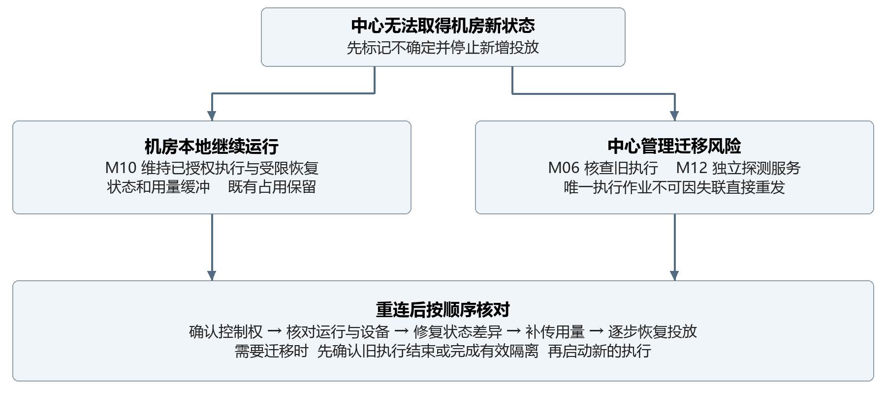
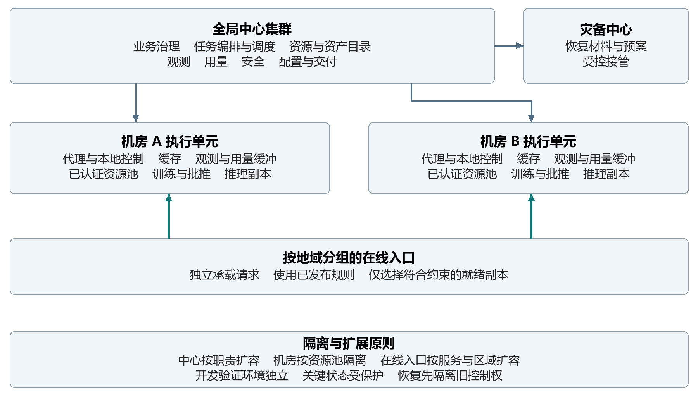

# 跨数据中心异构 AI 算力管理与调度平台

工业级系统模块设计与协作方案

版本 2.0  2026 年 9 月 19 日

## 1 建设目标与系统边界

本系统将多个数据中心中的 GPU、昇腾 NPU、网络和存储组织为可运营的算力服务。设计明确各模块的分工、协作及故障处理，使训练、微调、批量推理和在线推理能够长期稳定运行，并支持持续扩容与升级。

### 工业级建设目标

**统一服务。** 用户围绕项目、任务和模型服务使用算力，平台提供明确的能力选项与兼容范围。纳管两类芯片不意味着同一程序可以直接跨芯片执行。

**有边界的自治。** 全局中心管理权益和跨机房放置，机房负责本地准入与执行。中心短时中断时存量业务继续，新增授权和跨机房迁移受严格约束。

**全过程可解释。** 用户可以查清等待原因、执行位置、数据进度、恢复历史及资源释放情况；运维能定位受影响设备，费用能追溯到实际用量。

**故障可隔离。** 设备、集群、机房和中心分别构成故障边界。恢复先保护权限、容量和执行唯一性，不能因失联就在另一机房重复启动同一训练。

### 业务边界

| 业务类型 | 平台的组织方式 | 主要设计关注点 |
| --- | --- | --- |
| 训练与微调 | 一次紧耦合作业在具备合格高速互联的机房内成组运行 | 拓扑、长时间占用、检查点、故障恢复 |
| 批量推理 | 将输入拆为可跟踪分片，按进度处理与补跑 | 输出提交、重复处理、吞吐、数据位置 |
| 在线推理 | 在多个机房预先部署模型副本，通过独立路由承接调用 | 就绪、容量、流量、版本和请求延迟 |
| 算力运营 | 按租户和项目管理服务等级、容量、费用与维护 | 权限、配额、公平、可审计和可运营 |

跨机房同步训练可作为专项能力评估通信与成本条件；标准服务不默认具备该能力。跨机房恢复通常意味着使用已验证检查点重新启动，也不等同于进程无损热迁移。

<!-- page -->

## 2 总体模块架构

平台采用全局控制、机房自治执行、独立在线服务和贯穿全局的生产治理相结合的结构。管理流负责发布意图和核对结果，模型与数据走受控传输通道，在线请求走专用服务链路。

**全局中心**统一决定谁能使用哪些资源、任务放在哪里、服务需要多少容量。**机房执行单元**确认本地条件并落实执行，向中心报告实际情况。**在线服务单元**根据已经发布且有效的服务策略接收调用，不要求每次请求经过任务调度中心。

图中的模块是逻辑职责边界，不要求一开始就部署为 16 个独立微服务。业务门户与部分治理能力可以组合部署；任务编排、全局调度、机房执行、请求路由以及用量处理应具备独立扩容和故障隔离能力。实际部署单元见第 10 章。

<!-- page -->

## 3 模块清单与划分依据

共划分 16 个一级模块。划分依据是决策责任、生命周期和运行负载；模块之间通过明确的业务结果协作，避免把所有操作集中在一个调度服务中。

| 分组 | 模块 | 主要负责什么 |
| --- | --- | --- |
| 业务治理 | M01 统一门户与工作空间 | 面向各角色提供业务入口和项目视图 |
| 业务治理 | M02 租户身份与权限 | 确认操作者身份、项目归属和操作授权 |
| 业务治理 | M03 配额与服务等级 | 确定租户容量权益、借用规则和业务保障 |
| 资源调度 | M04 资源中心 | 维护设备能力、拓扑、健康和容量视图 |
| 资源调度 | M05 异构运行环境 | 提供经认证的芯片与软件执行组合 |
| 资源调度 | M06 任务编排 | 负责作业从提交到结束的完整生命周期 |
| 资源调度 | M07 全局调度 | 决定工作负载在哪个机房和资源池运行 |
| 模型执行 | M08 模型与数据资产 | 管理版本、授权、位置和产物来源 |
| 模型执行 | M09 传输与缓存 | 把正确版本可靠送达获准使用的机房 |
| 模型执行 | M10 机房执行与自治 | 本地准入、设备分配、执行和事实核对 |
| 在线推理 | M11 推理服务管理 | 管理服务部署、版本、副本和容量 |
| 在线推理 | M12 在线请求路由 | 将请求交给已就绪且符合策略的副本 |
| 生产运营 | M13 可观测性与运维 | 识别业务影响、定位故障和组织处置 |
| 生产运营 | M14 计量与成本运营 | 汇集可信用量、对账和成本分析 |
| 生产运营 | M15 安全与治理 | 管控运行安全、数据边界和审计证据 |
| 生产运营 | M16 平台交付与连续性 | 管理配置发布、升级、备份和灾备接管 |

三组边界尤其需要固定：任务编排管理进度，全局调度决定选址，本地执行确认设备；模型目录决定版本与授权，传输模块负责送达；推理服务管理副本，请求路由使用副本。这些边界在建设和运维中保持一致。

<!-- page -->

## 4 业务治理模块设计

### M01 统一门户与工作空间

**模块定位。** 提供租户使用平台和运维运营管理平台的统一入口。门户呈现业务事实、接受操作意图，并引导用户完成必要的资源与环境选择；资源是否分配、任务是否结束，由相应业务模块确认。

**内部组成。** 租户工作台展示项目资源、任务、模型、服务和预算；算法工作空间提供环境选择、交互开发、实验记录和产物导航；运维工作台展示机房状态、故障和维护计划；运营工作台展示服务目录、容量和用量。不同角色看到与其职责相符的操作，关键页面保留状态来源和更新时间。

**设计方式。** 任务创建按业务类型组织，逐步选择模型、数据、运行环境和资源等级，再显示兼容性与配额检查结果。用户可以保存任务模板，但每次运行仍重新校验权限和适用条件。实验记录关联输入版本、运行环境、执行历史和输出产物，支持结果追溯；模型质量判断由业务评价流程完成。

交互工作空间的资源申请与回收也由 M06 协调，具备闲置回收、最长租用时长、关停前通知和持久化工作目录。终端与文件访问继承租户权限，禁止绕过平台直接取得集群管理权限。批处理入口和交互入口采用同一套资源权益，防止开发环境长期占用生产保障容量。

**模块协作。** 门户向 M02 获取授权视图，向 M03 获取服务权益，组合 M04 与 M05 提供的可用资源和环境选项。任务操作交给 M06，服务操作交给 M11，资产管理交给 M08。M13 提供诊断与日志入口，M14 提供用量与费用状态；门户不承担这些模块的业务裁决。

**生产运行要求。** 页面刷新和客户端重试不会新建多份作业；对耗时操作显示已受理、处理中和最终结果。无法取得新状态时显示最近可信状态及其时间，不把缓存值描述为实时结果。取消、回滚等操作在后台持续完成，关闭页面不影响流程。跨租户搜索、下载和日志浏览均执行权限检查。

**设计完成判据。** 任一任务详情能完整解释输入、授权、排队原因、执行位置、运行历史、输出和费用状态，用户无需在多个独立系统之间人工拼接信息。

<!-- page -->

### M02 租户身份与权限

**模块定位。** 统一识别使用者、系统组件及其所属租户和项目，决定其可以操作或访问哪些对象。租户是隔离和权益边界，项目是日常协作与用量归集边界；跨项目和跨租户共享都必须由资产所有者明确授权。

**内部组成。** 企业身份接入、租户与组织管理、项目成员管理、角色与授权、服务身份管理、会话和凭证生命周期。人使用登录身份，自动化作业和机房代理使用各自受限身份，避免共用长期管理员凭证。

**设计方式。** 权限按角色与资源范围共同判定，并支持地域、数据敏感级别等条件。平台管理员、机房运维、租户管理员、算法工程师、服务负责人和审计人员职责分开；拥有资源运维权不自动拥有模型和数据读取权。临时授权具备明确期限，高权限操作经过授权流程并留下审计记录。

授权必须贯穿提交、调度、数据分发和实际执行。提交时通过检查，并不代表几小时后仍然允许读取同一数据集。排队中的任务在执行前重新确认关键授权；已经运行的任务遇到撤权时，按预先制定的策略停止新访问、收敛执行并保护已产生的数据，不由门户任意删除运行现场。

**模块协作。** M01、M06、M08、M11 和 M12 使用统一授权规则。M10 获得与具体执行绑定、范围受限的工作身份，M09 获得必要的数据读写权限。M15 负责密钥基础、安全基线和审计归集；M02 负责业务授权决策。M03 的配额检查在授权通过后进行，配额充足不能替代权限。

**生产运行要求。** 凭证轮换不依赖停机，撤销能够传播至机房和请求入口。中心故障时，只允许按风险等级继续使用尚在有效期内的已验证授权；过期凭证和高风险操作不能无限期依赖缓存。不同区域的临时凭证作用域独立，一个机房凭证泄露不能取得其他机房的管理权限。

**设计完成判据。** 租户隔离覆盖页面、日志、产物、缓存、运行环境和调用入口；身份失效、项目成员移除、服务凭证轮换均具有可验证的生效路径。

<!-- page -->

### M03 配额与服务等级

**模块定位。** 将租户购买或获配的服务权益转化为平台执行规则，明确可以使用多少、保障多少、允许借用多少以及何时需要归还。配额是使用上限和权益约束，物理可用容量由资源中心及本地执行共同确认，两者不能相互代替。

**内部组成。** 服务目录、资源池划分、租户与项目配额、保底与弹性权益、借用规则、容量预订和预算控制。服务目录区分芯片能力、隔离等级、地域、作业优先级及恢复等级，不能把不同芯片简单折算成通用卡数后承诺等价性能。

**设计方式。** 将资源权益分为保障容量、可借用容量和受限弹性容量。关键在线服务保留可兑现的保障容量，批任务可以按约定借用闲置资源。借用资源的回收需给出提前通知、检查点时间和最大等待期限，无法安全中断的任务不接受可随时回收的资源等级。

全局和机房内的占用必须一致考虑已分配、正在确认的预留以及待释放资源，防止多个并发请求各自认为还有余额。大任务在数据长时间准备阶段只保留合理的容量计划；临近启动时才申请有时限的硬预留，避免空卡长期等待数据。预留到期释放的是未启动承诺，不能自动回收已在运行但状态未明的资源。

**模块协作。** M07 执行队列公平、优先级和借用策略，M03 提供规则及权益占用约束。M06、M11 发起和结束资源需求，M10 报告实际分配与释放。M14 反馈费用和预算水位，M01 展示可申请范围。预算耗尽时的新任务限制和存量业务处置分别配置，避免突然停止关键在线服务。

**生产运行要求。** 配额变更、权益转移和预算调整保留版本与生效范围。断连机房只在预先划拨的本地权益范围内自治，不得同时由全局把这部分容量再发给其他机房。资源借用不会无限拖延保底任务，长期排队能够触发容量评估和运营升级。

**设计完成判据。** 每个租户的权益、实际占用、预留、借用及待归还能够解释和对齐，并能在并发提交和机房断连时维持上限约束。

<!-- page -->

## 5 资源与调度模块设计

### M04 资源中心

**模块定位。** 建立跨机房的资源事实视图，回答有哪些设备、具备什么能力、位于哪里、是否健康，以及在特定约束下还有多少可分配容量。资源中心负责汇总与核对，最终设备准入仍由机房内的执行单元确认。

**内部组成。** 机房与集群接入、设备资产发现、能力分类、拓扑管理、健康评估、库存核对、维护状态和容量分析。资源范围包括加速卡、主机计算与内存、高速网络、存储容量和关键配套能力，避免只管理 GPU 卡数而忽略真正限制任务启动的条件。

**设计方式。** 资源按机房、集群、资源池、机架、主机和设备组织。拓扑需要表达卡间互联、主机内关联和跨节点高速网络域；训练所需的设备组合在同一合格通信域内评估。集群合计空闲 16 张卡，不代表任意 16 卡训练都能启动。

库存区分总量、可服务量、已分配、已预留、待回收、维护和故障隔离。物理卡、硬件分区和软件共享份额分别统计，并保留归属关系，避免重复计数。资源视图同时标识最近观测时间和可信程度，失联资源从新增分配候选中移除，但其已有占用仍保留待核对状态。

**模块协作。** M10 提供本地事实和分配结果，M05 提供经过认证的运行能力，M07 根据资源视图筛选候选位置，M03 将资源池与服务权益关联。M13 提供健康趋势和故障影响，M16 组织设备或集群升级，M15 指定允许承载的安全等级。

**生产运行要求。** 新机房经历发现、校验、压测、试运行和正式纳管，不在注册成功后立即承载生产。重复发现能识别同一设备，设备替换和资源共享方式变化经过排空与重新核验。定期将平台占用与本地运行现场对账，差异先标记和隔离，不能为了账面平衡直接删除执行任务。

**设计完成判据。** 任一资源池能够给出可执行能力、约束、健康和占用构成，资源状态过期、重复上报或设备重配不会造成超分配。

<!-- page -->

### M05 异构运行环境

**模块定位。** 将芯片、驱动、框架、通信库、算子和模型的组合变为可选择、可验证、可回退的执行环境。平台向用户提供明确的适配结果，避免把底层软件差异直接转嫁给每个业务团队。

**内部组成。** 厂商适配层、运行环境目录、镜像与依赖管理、兼容认证、性能基线、环境版本和退役管理。适配层将设备发现、健康和运行控制转换为统一能力描述；厂商特有能力仍保留显式约束，不用虚假的统一参数掩盖差异。

**设计方式。** 每个可发布环境绑定经过验证的芯片系列、主机条件、基础软件组合和适用业务。训练、推理、整卡、分区和共享分别验证，结果包含可运行模型范围、精度限制、隔离能力和已知问题。相同模型在不同芯片环境上的效果与吞吐需要独立测量，不能直接以卡数或理论算力承诺等价。

认证包括启动与算子正确性、多卡通信、长稳运行、故障恢复和安全隔离。NVIDIA 时间切片不提供副本之间的显存和故障隔离，应明确作为特定共享服务等级使用，不能宣传为独占或硬隔离能力。[R02] 昇腾接入需要结合其设备管理与调度能力开展具体型号适配。[R04]

**模块协作。** M04 获得设备可执行的能力清单，M07 用认证范围过滤候选资源，M06 和 M11 固定任务或服务使用的环境版本。M10 负责装配运行环境并再次确认本地条件。M08 关联模型版本，M15 校验供应链安全，M16 执行环境发布、灰度和回退。

**生产运行要求。** 新环境先进入验证资源池，通过后扩大范围。升级期间保留旧环境，存量任务继续使用已批准版本；停止接收旧版本新任务与结束存量任务分别管理。发现高风险环境时，能够按受影响组合准确定位任务和服务，并通过受控流程限制使用或迁移。

**设计完成判据。** 用户选择的环境具有明确适用范围，调度与执行采用同一认证判断；不兼容组合在投入设备之前被识别，并能够说明缺少何种能力。

<!-- page -->

### M06 任务编排

**模块定位。** 负责训练、微调、批量推理从提交、准备、等待、执行到结束的完整业务过程。编排模块决定任务下一步需要完成什么条件；全局调度决定执行位置，机房执行负责真正启动和停止。

**内部组成。** 任务模板、业务校验、流程编排、运行历史、取消与重试、检查点恢复、产物确认和批量分片管理。支持单个作业，也支持数据准备、训练、评估、产物登记等有依赖关系的步骤。步骤依赖完成条件推进，失败后只重做必要步骤。

**设计方式。** 一项逻辑任务可以包含多次执行尝试，每次尝试有独立的启动、结束、用量和恢复来源。用户重试和系统恢复均保留原因，不能覆盖历史失败记录。任务状态区分排队、准备、已分配、启动中、运行中、收尾及结果不确定，页面显示的是已确认事实与待处理事项。

取消是一个持续收敛过程：停止新的调度和数据准备，通知执行单元，确认进程结束，处理产物，再释放配额和资源。不能收到取消请求就直接显示已停止。批量推理按输入分片维护完成边界，结果经过校验和正式提交后才算完成，失败补跑不覆盖已经成功提交的结果。

**模块协作。** M02、M03、M05、M08 提供授权、权益、环境和资产条件；M07 负责候选位置及容量确认，M09 准备数据，M10 提交执行事实。M13 提供诊断和恢复证据，M14 汇集各次尝试的用量。恢复地点变化要重新经过授权、兼容与数据准备检查。

**生产运行要求。** 同一操作反复送达只产生一次预期业务效果。事件可以延迟或乱序，编排仍按合法的生命周期关系推进。旧尝试尚未确认停止时，新尝试不能自动启动；若需要故障迁移，应先证明旧执行已经终止，或完成能够阻止旧执行继续工作的基础设施隔离。

**设计完成判据。** 提交、取消、重试、部分失败和平台重启后均能恢复推进；每次运行的输入、执行位置、恢复来源和输出可以连续追溯。

<!-- page -->

### M07 全局调度

**模块定位。** 在满足业务与安全约束的前提下，决定任务或服务副本进入哪个机房、集群和资源池，并在租户之间组织有保障的公平使用。调度输出是可解释的放置决策与容量意图，不越过机房内的设备准入控制。

**内部组成。** 多租户队列、硬约束过滤、候选评分、公平与优先级、预留与借用、抢占编排、策略模拟和决策解释。三类工作负载使用不同策略：训练关注成组资源与通信，批推关注吞吐和数据位置，在线服务部署关注可用性、容量与故障域分散。

**设计方式。** 首先排除不满足权限地域、数据许可、环境兼容、隔离等级、拓扑和可用容量的机房；随后比较预计等待、数据准备、负载、成本和恢复风险。采用过滤与评分结构便于解释和演进，Kubernetes 调度也采用相应阶段。[R01] 评分权重由服务等级与离线回放校准，不把固定权重当作普遍最优方案。

公平调度综合保障额度、实际占用和等待时间，限制单租户长期占满共享池。小任务回填不能破坏已承诺的大任务启动窗口；抢占先选择可恢复、获准被中断的任务，计入检查点成本和冷却时间。成本优化不能突破数据地域、隔离或保障容量这些硬条件。

**模块协作。** M03 给出权益规则，M04 给出资源与拓扑视图，M05 给出认证结果，M08 与 M09 给出数据位置和准备估计。M06 或 M11 发起放置需求，M10 对真实可用条件作最终确认。候选机房拒绝或准备超时后，由原发起模块保持业务连续性，调度重新评估候选。

**生产运行要求。** 同一资源范围只允许一个有效的分配决策者。机房报告延迟时保守扣留不明确的占用，不能用过期空闲量反复分配。策略变更先回放历史负载，再小范围放量，保留旧策略和解释记录。多集群分发组件可承担执行协调，服务权益、数据治理和业务评分由本平台定义。[R03]

**设计完成判据。** 任何一次分配都能解释过滤与选择原因，容量不足能够稳定排队，公平策略、优先级和资源借用不会互相矛盾。

<!-- page -->

## 6 模型与执行模块设计

### M08 模型与数据资产

**模块定位。** 管理平台使用的模型、数据集、检查点和运行产物，明确是什么版本、谁能使用、允许存放在哪里，以及由何次工作产生。该模块维护资产语义和生命周期，文件传输及本地缓存由 M09 实现。

**内部组成。** 模型目录、数据目录、不可变版本、共享授权、存储位置、来源关系、保留与删除策略。模型可以关联环境认证和评价记录，数据可以关联敏感等级、许可范围及有效期限，检查点标记完整性和可恢复条件。

**设计方式。** 任务与服务绑定固定版本，用户修改“默认版本”不会让已经排队或运行的作业悄悄切换输入。资产所有权和某机房是否有可用副本分别表达，存在副本并不代表任意租户能够读取。数据使用和数据复制都检查地域约束，跨机房调度不能绕过资产许可。

运行产物在上传、校验和确认后才正式登记为可用。训练检查点区分正在写入、已完整提交、通过恢复验证和失效，故障恢复只能选择适用的完整版本。模型评价结果作为业务依据提供给服务负责人，平台不因文件上传成功就自动认为模型可以上线。

**模块协作。** M06 固定输入并提交产物，M11 发布已批准的模型版本，M05 判断运行环境适用性。M07 读取位置和复制许可，M09 更新副本准备与删除结果。M02 提供授权，M15 给出保留、加密和敏感数据治理要求，M14 归集存储和跨机房传输成本。

**生产运行要求。** 删除先停止新引用，检查是否被任务、在线服务、恢复点或保留要求占用，再协调所有副本清理。运行中的必要文件被明确保护，不能被缓存淘汰误删。主副本不可用时选择经过校验且仍有授权的副本，不以“找到同名文件”代替版本确认。

**设计完成判据。** 任一结果可以追溯其模型、数据和环境来源；任一版本可以查清合法使用者、可用位置和当前引用，并且删除与恢复过程都具有可确认的完成结果。

<!-- page -->

### M09 传输与缓存

**模块定位。** 将任务或推理服务需要的模型与数据可靠送达目标机房，使执行过程具备足够的本地数据供给。该模块同时管理带宽和存储压力，避免大量模型冷启动拖垮跨机房网络。

**内部组成。** 传输计划、来源选择、跨机房通道、分块续传、完整性校验、热点预分发、机房缓存和淘汰保护。模型权重、训练数据和产物分别设定优先级，在线服务恢复所需资产与普通后台复制可使用不同带宽保障。

**设计方式。** 根据目标位置、已存在副本、网络条件、数据许可和启动时限选择来源。相同目标机房对同一版本的并发需求尽量合并传输；缓存按租户和资产授权隔离，物理去重不能暴露其他租户是否持有某个私有模型。任务引用期间固定必要内容，未被引用且可重新取得的内容才进入回收候选。

传输过程必须支持失败后继续、结果校验和有界重试，只有完整可读取的版本才能通知执行就绪。对可流式读取的数据，可以明确采用持续供给方式，但需要验证训练期间读取带宽，不能仅以“传输了首块”判断全部数据条件成立。准备时长预测反馈给全局调度，长时间准备不得无期限占住加速卡。

**模块协作。** M08 提供版本与权限，M07 提供候选目标和时限，M06 或 M11 跟踪准备进度，M10 确认本地可访问。M04 提供存储与网络能力，M13 观察带宽和错误，M14 汇集传输和存储用量。数据不可复制时直接反馈业务阻断原因，由调度选择允许的位置。

**生产运行要求。** 跨机房传输设置并发、速率和总带宽预算，并与生产推理通道隔离。网络波动或远端存储限流触发退避，磁盘水位不足先减少预取和清理可回收缓存，再阻止新准备任务，保护已经运行的业务。删除需要回报实际清理状态。

**设计完成判据。** 冷启动、缓存命中、断点恢复、校验失败和缓存紧张都有明确处理路径，任何未完整或无权读取的副本都不会进入执行就绪集合。

<!-- page -->

### M10 机房执行与自治

**模块定位。** 作为全局中心与本地算力之间的生产执行边界，负责接收已授权意图、核验本地条件、组织运行并回传事实。每个机房可包含多个执行集群和多个厂商资源池，机房自治不意味着代理可以自行扩大租户权限或跨区域重发任务。

**内部组成。** 机房代理、本地控制器、作业适配器、资源准入、拓扑调度、状态采集、本地恢复和离线缓冲。代理负责通信与核对，本地控制器负责工作负载生命周期；需要避免一个进程同时承担全部任务执行、海量日志上传和管理操作。

**设计方式。** 收到任务后先确认授权和当前有效控制者，再核验环境、数据、拓扑及容量。多卡训练以完整作业组准入，达不到最低可运行条件时不散落启动部分成员占住设备。准入与节点绑定可以由不同组件承担，但必须有唯一的准入权威和清晰的前后顺序，不能让两个调度体系各自承诺同一份容量。

实际启动、退出和设备回收均由本地观察确认。中心通信中断时维持已经获准的任务与服务，按预先授权的范围执行局部恢复，并缓存状态和用量。默认暂停新增全局任务及跨机房迁移；若需要断连期间接收本地工作，只能使用事先划拨、不会由中心重复发放的权益和资源范围。

**模块协作。** M07 提供放置意图，M06 或 M11 保有业务生命周期，M05 提供认证环境，M09 提供可读取资产。M04 获取库存事实，M13 获取运行观测，M14 获取原始用量，M15 约束本地身份与安全边界。重连后先交换执行现状，再恢复命令推进。

**生产运行要求。** 重复命令不重复启动，旧控制者不能继续分配；控制权变化与真正停止旧训练分别确认。代理升级具备错峰、兼容检查和回退能力。局部重启与全局重试明确分工，不能同时恢复出两份作业。执行证据不足时保留资源为待核对，不擅自释放。

**设计完成判据。** 中心中断、代理重启、设备故障和指令重复后，本地运行状态可核实、资源不重复分配、用量可补传、恢复不会生成双重执行。

<!-- page -->

## 7 在线推理模块设计

### M11 推理服务管理

**模块定位。** 将模型版本转化为能够对外持续服务的部署，管理服务副本、容量和发布过程。它决定需要哪些版本和副本以及期望流量比例，单次请求交给哪个已就绪副本由 M12 决定。

**内部组成。** 服务目录、版本发布、部署编排、健康就绪、弹性容量、灰度验证、回滚和退出排空。一个服务可以在多个机房运行多个批准版本，并分别设定最小副本、上限、地域和容灾保障。

**设计方式。** 新服务依次完成模型与环境确认、资源放置、资产准备、加载预热和业务探测。进程存活不等于模型就绪，必须确认权重加载完成、关键请求能够正确执行、容量状态正常后，才允许路由放入流量。灰度按受控流量验证延迟、错误和业务评价结果，达到条件后才扩大覆盖。

弹性根据排队、请求量、处理时长和实际加速资源压力共同判断，并考虑模型加载时间。扩容有冷却与最大速率，先增加可用容量再增加流量；缩容先停止新分流，再等待已有请求结束。关键服务保留跨故障域的最小容量，不能把所有空闲副本都因短时低负载回收。

**模块协作。** M08 固定模型版本，M05 提供适配环境，M03 管理保障容量，M07 决定副本位置，M09 准备权重，M10 执行部署。M12 接收已批准的版本、就绪位置和流量意图；M13 提供运行指标，M14 提供容量与调用成本，M15 控制模型发布和访问条件。

**生产运行要求。** 回滚需要旧版本仍具备可用环境、模型和足够容量。没有就绪替代副本时不先删除旧版本。中心暂时故障时现有副本与有效路由继续工作，新发布和跨机房容量调整暂停。服务恢复与训练恢复使用不同规则：独立推理副本通常可以补建，带会话或外部副作用的服务需满足其自身恢复约束。

**设计完成判据。** 新发布、扩缩容、版本灰度、机房退出和回滚都能按顺序收敛，不出现未预热副本被接入流量或缩容直接打断大量正常请求。

<!-- page -->

### M12 在线请求路由

**模块定位。** 承接在线模型调用，在满足租户、版本、地域和容量限制的已就绪副本中选择执行位置。它是低延迟数据通道，不能因任务中心、账单或管理门户临时不可用而一并停止服务。

**内部组成。** 调用入口、请求授权、流量配额、版本路由、地域选择、容量保护、过载排队、连接管理和请求用量采集。入口按区域或服务分组扩展，与模型副本共同形成在线服务故障边界。

**设计方式。** 先验证调用身份、服务权限、版本和地域约束，再从就绪副本中按负载、排队、网络距离和策略选择目标。模型加载或新增副本由 M11 组织，路由模块不能收到普通请求就自行发起无上限的资源申请。无可用副本时按服务约定限时等待或明确拒绝，避免无限排队将整个平台拖慢。

请求入口需要区别普通短请求、长时间生成和流式会话。结果尚未输出且请求符合可重试条件时可以选择替代副本；已经向用户输出内容的请求不能透明重放成另一段不一致结果。依赖会话状态或外部操作的服务定义单独的重试边界，不能仅依据网络超时认定原执行未发生。

**模块协作。** M11 提供有效部署与流量规则，M10 提供本地就绪事实，M02 与 M15 提供身份和访问约束，M03 提供调用权益。M13 接收延迟、错误和排队指标，并将压力反馈给 M11 扩容；M14 获取可信调用用量，结算延迟不阻塞正常请求返回。

**生产运行要求。** 路由规则按版本更新，可校验、灰度并回退；失去控制面时只在批准且有效的策略范围内继续服务。健康探测和短期熔断能快速绕开坏副本，重新加入采用观察窗口，避免频繁摇摆。资源过载时保护已接收请求和高等级业务，按明确规则限制新增流量，并为每个租户保留公平边界。

**设计完成判据。** 请求能够解释其授权、服务版本和执行地域，路由不会选择未就绪副本；过载、流式中断、机房异常和规则回退均有可预测的用户行为。

<!-- page -->

## 8 生产运营模块设计

### M13 可观测性与运维

**模块定位。** 从业务影响出发观察整个平台，组织故障定位、处置和复盘。模块将分散在中心、机房和设备上的信息关联起来，告警只代表需要调查的信号，任务与资源最终状态仍由业务控制模块核对。

**内部组成。** 指标监控、日志、调用链、业务事件、服务等级看板、告警关联、故障管理、维护编排和运行手册。观察维度从用户任务和模型服务下钻到机房、资源池、节点、卡和网络，避免只有设备图表而无法判断业务受损范围。

**设计方式。** 分别衡量管理操作可用性、任务受理与排队、成功启动、在线调用质量以及用量完整性。训练时长受模型和数据影响，在线延迟受模型与请求长度影响，因此平台责任与业务模型性能分别呈现。关键告警围绕服务受损和风险趋势设计，设备噪声通过关联与去重收敛。

故障处置采用发现、判断影响、止损、恢复、验证和复盘的流程。自动化仅执行已定义、范围受限并可核对结果的操作，如隔离已确认故障设备或暂停向异常机房投放。跨租户高影响操作、数据删除和大规模迁移进入授权流程；人工应急操作同样保留证据并在事后对账。

**模块协作。** M04、M06、M10、M11、M12 提供运行事实，M13 输出告警和恢复建议，由相应责任模块执行动作。M16 负责版本、配置和灾备编排；M15 参与安全事件处置；M14 汇集故障相关用量用于运营核对。维护窗口同步到调度与路由，防止维护期间继续增加新负载。

**生产运行要求。** 观测通道与生产工作隔离资源和限额，大量日志不能压垮执行代理。采集阻塞时优先保留故障证据和关键状态，按策略降低普通日志量，并显式报告缺口。采集端本身、告警通道和时钟偏差也需要监控。关键事件保留连续时间线，敏感内容按租户权限展示并脱敏。

**设计完成判据。** 值班人员可以从一次业务异常定位责任模块、查看可信现场并执行运行手册；处置结果经过业务验证，监控恢复不自动等同于任务已经恢复。

<!-- page -->

### M14 计量与成本运营

**模块定位。** 将资源使用与在线调用转化为可追溯、可对账的用量和成本，支撑租户预算、资源运营及结算。模块分别管理使用事实与计价规则，不能依据调度意图或监控曲线猜测用户应付费用。

**内部组成。** 用量采集、接收与去重、差异核对、计价版本、成本归集、预算反馈、结算和争议处理。使用事实覆盖资源分配时长、实际服务调用以及约定计费的存储和传输；计费维度和单位在服务目录中清楚约定。

**设计方式。** 资源型用量以实际分配和释放的确认记录为基础，在线调用用量以请求处理结果和约定统计规则为基础。失败尝试、取消和抢占是否收费由合同或服务规则决定，原始事实保留完整。不同价格版本按生效范围使用，调价不回写历史使用记录；修正通过可追溯的调整完成。

用量在设备或服务执行侧产生，中心能够处理重复、延迟和补传。对同一运行过程分段核对，识别漏报、重叠和异常时钟。机房失联期间保留暂估视图并标记可信程度，恢复后依据实际事件对账；没有足够证据时不把暂估数直接当作已确认结算结果。

**模块协作。** M10 提供资源分配事实，M12 提供请求用量，M09 提供传输与缓存使用，M08 提供资产归属。M02 提供租户与项目关系，M03 提供服务等级和预算控制入口，M13 提供采集异常线索。正式财务总账、发票或支付系统可对接结算结果，其业务规则单独管理。

**生产运行要求。** 采集和核对流程具备独立容量，接收暂时中断时执行侧缓冲并补传。缓冲接近极限要提前告警，并按约定限制新的付费资源准入，不能默默丢失用量。存量业务处置遵守既定服务策略，不由结算进程直接杀死任务。对账差异有责任人和关闭证据。

**设计完成判据。** 一笔费用能够追溯到租户、项目、使用对象、实际用量、价格版本和调整原因，断连恢复后既不会重复收费，也不会隐瞒未确认的计量缺口。

<!-- page -->

### M15 安全与治理

**模块定位。** 为跨机房和多租户运行提供统一安全约束，保护平台控制权、模型数据和运行环境。它负责规则、执行支撑与证据；各业务模块在自己的决策点落实对应约束，不能只在入口检查一次。

**内部组成。** 运行隔离、安全基线、密钥与证书管理、软件供应链、数据边界、风险审批、审计和安全事件处置。身份与业务授权由 M02 负责，M15 提供可信身份基础、安全策略及持续验证，避免建立两套冲突的授权体系。

**设计方式。** 根据租户信任关系和数据级别选择共享资源池、专用节点池或独立集群。隔离同时覆盖计算、显存、网络、文件和凭证；容器或命名空间并不自动构成所有场景下足够的安全边界。外部调用、任务下载、跨机房复制和产物导出分别进行控制，调度优化不得改变数据允许的地域。

镜像、运行环境和交付包在发布前完成来源验证、漏洞检查和准入批准。运行过程中限制高权限、宿主机访问和无关网络出口，凭证按工作范围下发并支持轮换。密钥与备份一起考虑恢复路径，但不把密钥明文与业务备份混放。

**模块协作。** M05 和 M16 在环境与平台发布时执行安全准入，M07 在放置时执行隔离和地域约束，M08 与 M09 控制资产访问和复制，M10 落实运行隔离，M12 限制服务访问。M13 关联安全告警，M02 执行身份撤销，各模块向统一审计通道提供关键行为证据。

**生产运行要求。** 安全规则具有版本、生效范围和失效处理，紧急限制能够精确命中受影响机房、环境或租户。审计保留操作者、对象、动作、原因和结果，并防止普通管理员随意修改。审计暂时不可达时缓冲关键证据，高风险操作按预定策略暂停，不能为了保持操作畅通而失去必要控制。

**设计完成判据。** 权限绕过、跨租户读取、未批准环境、非法地域复制和高权限执行均有检测与阻断点；安全处置能撤权、隔离、追踪并验证恢复结果。

<!-- page -->

### M16 平台交付与连续性

**模块定位。** 使平台能够被重复部署、安全升级、持续维护，并在中心故障或灾害后恢复服务。交付对象既包含中心系统，也包含机房代理、运行环境、配置、策略和操作手册。

**内部组成。** 环境交付、配置与版本管理、变更验证、灰度发布、兼容检查、回退、备份恢复和灾备演练。开发、验证、预生产与生产具有清晰边界，离线环境具备完整的软件包、校验和依赖说明。

**设计方式。** 统一记录平台期望配置和已经生效的配置，变更经过校验、影响判断、小范围发布与扩大验证。中心与代理升级支持有界的混合版本运行；不兼容变更先完成过渡，再逐批升级机房。调度策略、路由策略和运行环境分别发布，避免一次全局升级同时改变所有风险点。

备份覆盖业务控制状态、权限策略、配置、关键资产目录、已确认用量及恢复所需凭证材料。业务模型和训练检查点根据各自恢复等级保护，不能只备份管理系统就宣称训练可恢复。定期用备份实际恢复并核对完整性，备份作业显示成功只是过程证据。

**模块协作。** M13 提供发布健康与业务影响，M04 标记维护资源，M07 暂停向维护范围投放，M06 协调可恢复任务，M11 与 M12 执行服务排空。M10 逐批升级并核对本地状态，M15 检查供应链与权限，M14 核对跨恢复边界的用量。

**生产运行要求。** 灾备接管首先确认旧中心失去写入和控制能力，再启用新中心并核对机房执行现状。恢复不能在另一中心直接重放全部未完成任务。回退要检查配置与状态是否可逆，存在不可逆变化时预先设计兼容过渡和前向修复，不能仅保留旧安装包就称为可回滚。

**设计完成判据。** 新机房接入、代理滚动升级、策略回退、中心重建和灾备接管都可按运行手册重复执行，并以业务恢复、权限正确和账实一致作为完成条件。

<!-- page -->

## 9 模块交互与关键业务流程

### 训练与微调的完整协作

**进入队列。** M01 接受任务意图，M06 组织 M02、M03、M05、M08 确认授权、权益、环境和输入版本。提交校验通过只代表任务有效，具备真实可用容量后才能启动。检查不通过时返回可解释原因。

**决定位置与准备。** M07 结合 M04 的资源、M08 的位置和 M09 的准备预测选择候选机房。M09 先完成必要数据准备，随后在启动窗口内协调 M03 与 M10 确认容量；数据就绪、配额有效、本地拓扑成立三项同时满足，才正式启动。

**执行与收尾。** M10 成组运行任务，持续报告实际状态与检查点。M06 确认结果和 M08 的产物登记，M10 确认设备释放后再关闭相应占用。M14 独立核对运行用量，计费处理延迟不改变已经确认的任务执行结果。

**异常分支。** 数据准备失败只重做准备步骤；机房拒绝准入则释放未启动预留并重新排队。执行失败由 M06 判断是否可恢复；M10 负责收敛旧执行，M07 重新选址。恢复不能绕过旧执行确认与检查点验证。

<!-- page -->

### 在线服务发布与请求调用

**服务发布。** M11 接收服务负责人批准的版本与容量要求，经 M02、M03、M05、M08 校验，交由 M07 选址，M09 准备模型，M10 启动副本。模型完成加载和业务探测后，M11 才向 M12 发布可接入的位置及灰度规则。

**请求处理。** M12 对调用身份、服务权限、地域和速率进行检查，选择有效且就绪的目标，结果沿在线链路返回。单次请求不依次穿过任务中心、全局调度、模型目录和账单系统。必要规则在入口侧受控分发，并设置有效期及失效行为。

**容量反馈。** M13 将请求排队、错误和延迟反馈给 M11。M11 在权益范围内申请扩容，新副本经过同样的准备与就绪流程后再分配流量。扩容未完成期间，M12 实施有界排队和过载保护，不承诺超出实际服务能力的请求。

**故障与回滚。** 坏副本先从新流量候选中移除，M11 组织补建；已有流式请求按服务约定报告中断。版本质量异常时，先确认旧版本具备容量，再调整流量并排空新版本。跨区域切换也必须满足数据和会话约束。

<!-- page -->

### 机房失联与恢复核对

**第一步识别不确定性。** M13 发现中心无法取得机房新状态，M04 标记状态过期，M07 停止新增投放。失联可能仅是管理通道故障，机房内的训练和在线服务仍可能正常运行，因此已有资源占用保持待核对。

**第二步保持本地运行。** M10 继续已经授权的任务与服务，按边界执行本地恢复并缓存状态、用量。M12 根据独立的服务探测判断在线路径是否仍可用；如果只是管理链路异常，不盲目中断仍健康的数据链路。授权或路由规则失效时按既定安全策略收敛。

**第三步决定是否迁移。** 对训练和其他具有唯一执行要求的工作，M06 只有在旧执行已终止或完成有效基础设施隔离后，才允许使用可信检查点重新启动。仅让旧代理不能继续接单，并不能证明原训练停止。独立推理副本可以按服务状态与权益补建，但有状态会话需单独恢复。

**第四步重连对账。** 先确认当前控制权和机房运行现状，再核对任务、设备、资产副本及用量。中心恢复遗漏信息，本地拒绝过期命令；发现重复或未知执行时先限制影响并人工核实。完成差异处理后逐步恢复投放，不能重连即全部放量。

<!-- page -->

### 资源扩容与计划维护

**资源扩容由 M16 牵头。** 机房运维准备设备和网络，M10 接入本地能力，M04 建立资产与拓扑，M05 完成环境和通信验证，M15 完成安全检查。通过后先进入验证资源池，再由 M03 挂接服务权益，最后允许 M07 投放生产工作。

扩容不能仅验证“卡可见”。必须确认需要的网络域、存储供给、环境认证、日志与用量通道同时具备能力。新容量只对适配通过的工作类型开放，尚未验证的厂商组合和模型场景保留明确限制。

**计划维护由 M13 组织并由 M16 执行变更。** M04 将目标范围标记为禁止新增分配，M07 停止投放；M11 在其他位置准备替代副本，M12 排空流量；M06 通知任务保存检查点或等待自然结束，M10 确认剩余工作和设备释放。

只有在保护范围内的业务已处理完成、资源已排空且回退条件成立后，才进入维护。无法安全迁移的长任务须由业务负责人选择延后维护、计划中断或按约定接受影响。维护结束后重新验证设备、环境和业务，再逐步解除限制。

### 模型更新与资产退役

**模型更新由 M08 和 M11 协同。** 新模型创建独立版本，M05 确认环境，M09 提前分发，M11 发布并验证，M12 小范围引入流量。M13 观察技术质量，服务负责人确认业务效果后扩大使用范围。旧版本继续保留到回滚窗口结束。

**资产退役由 M08 牵头。** 停止新引用后检查任务、服务和恢复点，M06 与 M11 解除使用关系，M09 清理缓存和副本，M15 确认保留要求，M14 关闭对应存储计量区间。离线机房未反馈清理结果时显示待清理，不能提前宣称全局删除完成。

### 协作时的共同规则

跨模块操作可以分阶段完成，但每一步必须有明确的发起者、完成条件、超时行为和善后责任。已经运行的任务、已经提交的结果和已经发生的用量不能通过简单“撤销上一操作”抹去；需要由各自责任模块收尾、补偿或纠正。

<!-- page -->

## 10 生产部署与故障隔离

### 部署单元与扩展方式

**全局中心集群。** 业务治理、资源目录、编排与调度构成管理面，按规模组合部署并逐步分片。关键组件跨独立故障域多副本部署，采用受控主备或仲裁机制。同一资源范围同时只有一个有效分配者，持久化状态和协调能力具备冗余，避免单点失效。

**机房执行单元。** 每个机房具备自己的执行控制、缓存、运行观测和用量缓冲，内部可以继续按集群或资源池隔离。厂商适配问题优先限制在相应资源池，单个代理或机房故障不触发其他机房一起重启或重复执行。

**在线服务单元。** 入口和模型副本按地域、服务组或租户等级扩展，流量承载与后台任务调度分别伸缩。容量按目标故障域失效后的剩余承载能力预留，不能仅以日常平均负载判断是否满足容灾要求。

**灾备与管理边界。** 灾备中心具备接管所需配置、关键状态和恢复材料；接管先隔离旧控制权，再核对现有执行。研发和验证环境独立于生产，高风险运维入口与普通用户入口分离。备份传输不与关键推理通道争用全部带宽。

<!-- page -->

### 全局故障下的业务行为

| 故障范围 | 继续提供的能力 | 必须限制或暂停的能力 |
| --- | --- | --- |
| 门户故障 | 后台任务继续，在线调用继续 | 门户操作与页面查询 |
| 全局调度故障 | 已运行任务与已部署服务继续 | 新放置、跨机房再平衡和调度策略变更 |
| 全局中心中断 | 本地已授权执行，有效规则下的在线调用 | 新授权、全局权益转移、未确认的新任务 |
| 模型源存储异常 | 已缓存且校验通过的授权版本继续使用 | 依赖缺失版本的启动与发布 |
| 单机房不可达 | 其他机房正常运行，失联机房按边界自治 | 向失联机房新增投放和未经核实的训练重发 |
| 用量接收故障 | 缓冲范围内继续采集与执行 | 无法控制计量缺口时的新付费准入 |
| 观测系统故障 | 业务执行保留独立运行能力 | 依赖完整观测证据的自动发布和高风险变更 |

限制在故障恢复和状态核对完成后解除。某能力可以继续并不意味着可以无限期运行；授权有效期、缓冲容量、检查点保护和备用容量共同决定可持续时间，应按服务等级进行验证。

### 网络与存储的设计责任

网络至少在逻辑上区分管理通信、机房内训练通信、跨机房数据传输和在线请求。训练通信依赖合格的本地高速网络；跨机房复制受带宽预算控制；在线链路优先保障请求时延。管理中心避免承载大模型权重和训练数据的全部中转流量。

业务控制状态、模型与数据资产、执行临时文件、日志和用量采用各自适合的持久化与保留策略。它们可以共享基础设施，但需要独立容量保护和故障预算；某个租户产生大量日志或缓存，不能耗尽平台控制状态的存储空间。

### 恢复目标的确定方式

分别制定控制中心恢复、在线服务恢复、训练进度保护和用量完整性目标。训练的可接受进度损失由检查点间隔与可用副本决定；在线恢复由备用容量、模型预热和路由切换决定。目标经容量规划与演练冻结，不能用单一“平台高可用”指标代替。

<!-- page -->

## 11 模块协作的控制规则

### 决策责任与事实来源

| 需要决定的事项 | 决策责任 | 必须依据的事实或约束 |
| --- | --- | --- |
| 用户能否操作与读取 | M02 租户身份与权限 | 项目授权、资产许可和 M15 安全条件 |
| 租户可以占用多少容量 | M03 配额与服务等级 | 服务权益、预留和实际占用 |
| 任务下一步如何推进 | M06 任务编排 | 各阶段完成证据与当前执行状态 |
| 应在哪个机房运行 | M07 全局调度 | M03 权益及 M04、M05、M08 的约束 |
| 当前可否实际启动 | M10 机房执行与自治 | 本地设备、拓扑、数据和有效授权 |
| 输入和产物是什么版本 | M08 模型与数据资产 | 版本来源、完整性与授权 |
| 文件是否真正准备好 | M09 传输与缓存 | 传输校验和本地可读取结果 |
| 服务需要哪些副本 | M11 推理服务管理 | 服务期望、容量政策和就绪情况 |
| 请求送到哪个副本 | M12 在线请求路由 | 有效路由、实际健康与请求约束 |
| 用量是否可以结算 | M14 计量与成本运营 | 实际使用、差异核对和计价规则 |
| 是否进入灾备接管 | M16 平台交付与连续性 | 授权决策、旧中心隔离和恢复验证 |

**意图与事实分开。** “希望运行”不等于“已经启动”，“请求取消”不等于“已经停止”。编排向执行发出意图，执行回报事实；资源中心和门户只能在事实基础上更新可用状态。

**消息与核对配合。** 状态变化主动通知相关模块，同时定期核对完整运行现状。通知允许重复和延迟，接收方按身份和业务状态去重；丢失通知后可以通过核对恢复，不能仅依赖一次成功推送。

**控制权与执行唯一性分开。** 当前有效控制者有权发布新意图，旧控制者必须失去该权力；但旧进程可能仍在运行。任务重发还必须确认旧执行终止或已被有效隔离，防止两个机房同时训练或写入同一份结果。

<!-- page -->

### 联合设计验证标准

评审以真实业务链路和故障行为为单位，既检查模块自身能力，也检查责任交接是否完整。各模块不能只凭页面或单独演示判定生产设计完成。

| 联合场景 | 应当验证的结果 | 主要协作模块 |
| --- | --- | --- |
| 不兼容环境或非法地域 | 任务被明确阻止，说明原因，无设备被误占 | M02 M05 M07 M08 M15 |
| 多租户并发争抢容量 | 权益不超发、等待可解释、保底可兑现 | M03 M04 M07 M10 |
| 多卡成组训练 | 拓扑满足后整体启动，失败可收敛释放 | M05 M06 M07 M10 |
| 大模型冷启动 | 数据准备不拖垮网络，未就绪副本无流量 | M08 M09 M10 M11 M12 |
| 重复提交和重复命令 | 只产生一次预期效果，历史可核对 | M01 M06 M07 M10 |
| 机房失联和重连 | 存量占用不丢失、不盲目重发、状态可修复 | M04 M06 M07 M10 M14 |
| 训练恢复与结果提交 | 旧执行已收敛，检查点可信，结果不被覆盖 | M06 M08 M09 M10 |
| 推理过载与扩容 | 有界排队，先就绪后接流量，租户互不拖垮 | M03 M07 M11 M12 M13 |
| 灰度失败和回滚 | 旧版本有容量，流量回退，长请求按约定结束 | M08 M09 M11 M12 M13 |
| 撤权与资产删除 | 停止新访问，处理现有引用，副本清理可确认 | M02 M06 M08 M09 M11 M15 |
| 计量延迟及重复补传 | 用量不重复，缺口可识别，费用可追溯 | M03 M09 M10 M12 M14 |
| 维护升级和中心接管 | 业务被保护、控制权唯一、恢复后账实一致 | M04 M06 M10 M11 M13 M16 |

### 设计评审应形成的共同成果

设计评审明确各模块的责任团队、运行边界、依赖条件、完成证据和恢复权限，冻结服务等级、自治范围及地域约束，形成共同设计基线。变更时由模块负责人共同评估上下游影响，确保每条业务流程有人负责到底。

<!-- page -->

## 附录 技术依据

以下资料用于核对基础组件的职责与能力边界。本文中的 16 个模块及其协作方式属于本项目的设计建议，不代表任一开源组件已经提供全部能力；实际硬件、组件版本与运行组合须经过适配认证。

[R01] Kubernetes Scheduler

用于参考过滤与评分的调度结构。跨机房的业务权益、数据位置和生产策略仍需在本平台中设计。

https://kubernetes.io/docs/concepts/scheduling-eviction/kube-scheduler/

[R02] NVIDIA GPU Operator GPU Sharing

用于核对时间切片的共享与隔离边界。共享服务等级应按硬件方式和实测条件定义。

https://docs.nvidia.com/datacenter/cloud-native/gpu-operator/latest/gpu-sharing.html

[R03] Kueue MultiKueue

用于参考管理集群与执行集群之间的工作负载分发。组件选型需服从全局编排、本地准入和故障恢复的责任划分。

https://kueue.sigs.k8s.io/docs/concepts/multikueue/

[R04] 昇腾 MindCluster Ascend Device Plugin

用于参考昇腾设备接入与管理能力。该资料具有明确版本范围，项目应按实际芯片、驱动及软件组合开展验证。

https://www.hiascend.com/document/detail/zh/mindcluster/72rc1/clustersched/dlug/mxdlug_005.html

资料查阅日期 2026 年 9 月 19 日
