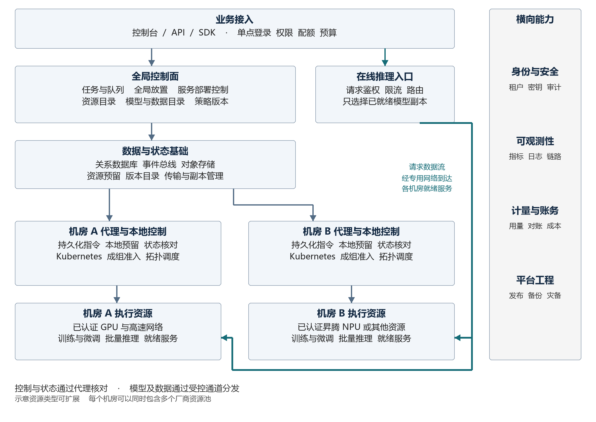

# 跨数据中心异构 AI 算力管理与调度平台

工业级项目总览与建设规划

版本 1.0  |  2026 年 9 月 18 日  |  适用阶段 立项与总体设计评审

## 1 项目定位与建设结论

本项目建设面向多数据中心、多租户和异构加速芯片的统一算力运营平台。平台统一接入 NVIDIA GPU、昇腾 NPU 及经认证的其他算力资源，为训练、微调、批量推理和在线推理提供资源申请、任务调度、模型分发、运行观测、故障恢复、用量计量与成本管理能力。

建设目标是形成可长期生产运行、可持续扩容和可审计交付的平台。完整建设范围包含业务功能、数据与接口契约、可靠性、安全、多租户治理、交付工具链和运营体系。阶段划分服务于依赖管理与风险控制；所有生产能力均纳入总体预算、责任分工和最终验收。

建议采用统一全局控制面与机房自治执行面的分层架构。全局控制面负责租户策略、配额、跨集群选址和生命周期管理；机房代理负责持久化接收指令、协调本地控制器并核对执行事实。训练与微调采用机房内的拓扑感知成组调度，在线推理在多个机房部署就绪副本，由独立请求路由链路承接流量。

### 1.1 核心建设成果

| 成果 | 建成后的业务能力 | 评估方式 |
| --- | --- | --- |
| 统一资源供给 | 查询可用资源、申请容量、配置配额与预留，识别不同芯片和隔离等级 | 资源账实一致、配额准确、兼容约束可验证 |
| 统一作业平台 | 管理训练、微调、批推的提交、排队、执行、恢复与产物 | 生命周期完整、重复操作安全、运行过程可追溯 |
| 统一推理服务 | 发布和扩缩容模型服务，控制版本、灰度流量及访问权限 | 服务可用性、请求延迟、容量与回滚演练 |
| 跨机房资源优化 | 在满足合规和兼容约束后优化等待时间、数据准备和成本 | 同一工作负载集与基线策略的对照报告 |
| 可持续生产运营 | 支持监控、值班、故障处置、容灾、安全审计与计量对账 | SLO、演练记录、账单核对与运维接管 |

### 1.2 项目管理基线

推荐以约 40 周作为完整建设和生产稳定性验证的计划基线，平均配置约 20 名全职等效人员，工作量参考区间为 180 至 240 人月。该估算以已有机房、网络、基础 Kubernetes 集群和至少两类可用异构测试硬件为前提；设备采购、线路建设及新增行业认证另行安排。

本文件定义产品边界、总体方案和立项级验收基线。容量与性能数值均为建议目标，需在需求基线评审中由业务、架构、SRE 和安全负责人共同冻结。组件版本、模型性能和硬件价格须通过适配验证与采购询价确定，不作为本文件中的既定事实。

## 2 建设范围与业务边界

### 2.1 全量建设范围

平台覆盖机房与集群接入、资源目录、租户与项目、工作空间、任务中心、调度中心、模型和数据目录、传输与缓存、推理服务、可观测性、计量计费、审计和运营管理。支持私有化部署、受控混合云接入、企业单点登录、API 与 SDK，以及离线环境中的镜像和安装包交付。

| 范围领域 | 平台承担的责任 | 外部系统或前置条件 |
| --- | --- | --- |
| 基础设施 | 纳管、健康发现、资源分配、维护编排、容量报告 | 机房供电、设备维修、网络专线和物理安全 |
| 训练与微调 | 环境模板、队列、分布式作业、检查点和产物管理 | 模型代码、算子实现、业务数据质量和训练目标 |
| 在线与离线推理 | 部署、路由、批任务、限流、用量和容量管理 | 模型效果评价、模型权利与业务内容治理 |
| 数据管理 | 元数据、版本、授权、位置、传输、缓存与生命周期 | 原始数据生产、外部数据治理及源系统权限 |
| 商业运营 | 价格版本、计量、结算明细、预算控制和账单导出 | 财务总账、支付、发票和正式收入确认 |
| 安全治理 | 身份、租户隔离、加密、审计、安全基线与证据 | 企业身份源、密钥根、行业合规认定 |

### 2.2 训练与异构能力边界

标准生产服务将单次紧耦合分布式训练放在一个具备合格高速互联的机房内执行。跨机房训练不是技术上绝对不可行，但需要单独验证专线质量、通信开销、同步策略和成本收益，作为专项能力通过独立评审。平台支持跨机房排队选址、检查点恢复和作业迁移流程，迁移不承诺进程无损热迁移。

“统一纳管”不代表 CUDA 与 CANN 工作负载自动兼容，也不代表不同芯片卡数可以等价相加。模型、算子、框架、运行时和驱动必须组成经过验证的执行配置。跨芯片迁移以已认证的镜像、模型格式、精度与性能报告为准；无法兼容的请求在准入阶段明确拒绝。

资源共享提供整卡独占、硬件分区以及经验证的软件共享等服务等级。不同等级的显存、故障和性能隔离承诺必须单独描述。对不互信租户，按安全等级使用专用节点池、虚拟化隔离或专属集群。时间切片不能被描述为显存隔离。[R03]

### 2.3 建议规模与容量分档

| 项目 | 建设规划范围 | 联合验收基线 |
| --- | --- | --- |
| 机房与集群 | 5 至 20 个机房，10 至 100 个执行集群 | 控制面模拟 20 个机房、100 个集群 |
| 节点与加速卡 | 约 2,000 节点，最高 10,000 张物理卡 | 10,000 卡目录与分配记录；切片另计 |
| 租户与活跃任务 | 500 租户，10,000 个非终态任务 | 混合队列、配额与故障场景同时加载 |
| 真实硬件环境 | 至少 3 个独立故障域，覆盖 NVIDIA 与昇腾 | 至少一组跨节点训练拓扑和跨机房推理服务 |
| 规模扩展 | 超出基线后按区域分片扩容 | 必须重新提交容量模型和压力测试报告 |

模拟集群用于验证控制面规模与一致性，不能代替真实芯片兼容、训练通信、显存隔离或模型性能验收。真实硬件型号与卡数在第 4 周前冻结；如测试资源不足，相应验收项不能判定通过。

## 3 用户角色与关键业务场景

| 角色 | 常用操作 | 权限与责任边界 |
| --- | --- | --- |
| 平台管理员 | 接入机房、配置全局策略、发布组件 | 生产变更受审批和审计，不能绕过租户数据授权 |
| 机房运维人员 | 设备维护、故障隔离、集群升级 | 仅管理授权机房，不直接修改平台计费事实 |
| 租户管理员 | 管理成员、项目、配额与预算 | 在所属租户范围授权，不能提升平台权限 |
| 算法工程师 | 创建训练、微调、批推，查看日志和产物 | 按项目访问数据、密钥与模型版本 |
| 推理服务负责人 | 发布版本、灰度、扩缩容、回滚 | 负责模型服务 SLO 和发布验证 |
| 运营与财务人员 | 定价、用量、对账、成本分摊 | 定价与账务调整分权，保留历史版本 |
| 安全与审计人员 | 查询审计、检查隔离、追踪风险 | 审计访问只读且自身操作可审计 |

训练与微调场景：用户选择模型版本、数据集版本和执行模板，声明卡型、卡数、网络拓扑及截止时间。平台验证权限与兼容性，将任务纳入租户队列，准备数据并预留资源；本地控制器完成成组启动。训练期间展示真实运行状态、检查点、日志和用量，完成后登记产物与来源关系。

批量推理场景：用户指定输入清单和输出位置，平台按可重试的分片执行，记录每个分片的提交与完成状态。输出采用临时目录、校验和提交标记，避免重试覆盖已完成结果；平台支持失败分片补跑、速率上限和结果清单下载。

在线推理场景：服务负责人发布固定模型版本，为多个机房配置最小副本与容量上限。模型预热并通过就绪验证后才接收流量。网关按租户权限、模型版本、区域约束和剩余容量路由；发布支持灰度、回滚与长连接排空。

运营场景：运维人员计划机房维护，平台禁止新增分配、迁移可恢复作业、排空在线流量并跟踪剩余工作。运营人员按租户与项目核对用量和账单，能追溯到任务、执行尝试、资源分配和计价版本。

## 4 产品能力与模块规划

| 编号 | 模块 | 完整建设能力 | 主要交付物 |
| --- | --- | --- | --- |
| F01 | 资源中心 | 机房与集群注册，卡型目录，节点拓扑，健康，维护，资源预留与库存核对 | 资源门户、设备目录、接入规范 |
| F02 | 租户与工作空间 | 组织、项目、成员、角色、凭证、配额、预算、环境模板 | 权限矩阵、租户控制台 |
| F03 | 任务中心 | 训练、微调、批推、队列、取消、重试、检查点、产物与日志 | 任务 API、SDK、生命周期控制器 |
| F04 | 全局调度 | 硬约束、评分、公平共享、资源预留、拓扑、抢占、模拟和策略审计 | 调度服务、策略版本库、解释页面 |
| F05 | 模型与数据 | 不可变版本、位置、授权、血缘、校验、复制、缓存、保留和删除 | 目录服务、传输服务、生命周期策略 |
| F06 | 机房代理 | 资源上报、指令执行、持久化回执、状态核对、断连自治与升级 | Agent、适配器、协议和安装包 |
| F07 | 推理服务 | 模型部署、版本、灰度、流量治理、弹性、路由、限流与服务指标 | Serving 控制器、路由网关、服务门户 |
| F08 | 观测与运维 | 指标、日志、链路、事件、告警、容量、值班和故障管理 | 运维看板、告警规则、操作手册 |
| F09 | 计量与成本 | 用量事件、价格版本、日结月结、对账、退款冲正与成本归集 | 用量账本、账单服务、财务接口 |
| F10 | 安全与治理 | SSO、密钥、隔离、审计、镜像签名、供应链与数据访问策略 | 安全基线、审计门户、验证报告 |
| F11 | 平台工程 | 安装、GitOps、升级、回滚、备份、灾备、离线交付与版本兼容 | 交付流水线、部署包、运维工具 |

控制台至少提供全局运营视图、租户工作视图和机房运维视图。任务详情需要展示排队原因、过滤失败项、资源分配、执行历史、最近一次观测时间、费用状态和可执行操作。状态不确定时显示“待核对”，不得展示为已失败或已释放。

## 5 总体架构与部署结构

### 5.1 分层架构

平台分为业务接入层、全局控制层、数据协同层、机房代理层和本地执行层。安全、可观测性和计量能力贯穿各层。在线推理的数据流量经由专用网关和就绪副本传输，避免让任务控制服务成为推理请求的必经路径。



### 5.2 服务职责与数据归属

| 服务域 | 核心职责 | 权威数据 |
| --- | --- | --- |
| 身份与策略 | 身份映射、项目权限、配额与预算规则 | Tenant、Project、Policy、Quota |
| 资源目录 | 资产、能力、拓扑、健康、可分配视图 | Resource、Capability、TopologySnapshot |
| 任务与调度 | 接收意图、排队、选址、预留与恢复 | Job、Attempt、Placement、Reservation |
| 模型与传输 | 版本、来源、位置、传输状态与缓存租约 | ArtifactVersion、Replica、Transfer |
| 服务与路由 | 发布期望、就绪端点、流量策略与容量 | Deployment、Revision、Endpoint、Route |
| 计量与账务 | 用量去重、结算、价格和冲正 | UsageEvent、LedgerEntry、PriceVersion |
| 审计与观测 | 操作证据、链路和运行诊断 | AuditEvent、Telemetry；不替代业务账本 |

关系型数据库保存业务权威状态，使用事务约束和唯一索引控制重复操作。事件总线传播状态变化与异步任务，采用事务发件箱避免“数据库已写入、事件未发出”。Redis 等缓存只承担查询加速、限流和临时缓存，不作为资源归属或计费事实的唯一来源。

### 5.3 高可用部署

核心 API、目录、调度、控制器与网关多副本部署，跨至少三个本地区域故障域分散。调度按队列或资源池分片，每个分片只有一个有效写入者，依靠租约和递增隔离令牌拒绝旧实例操作。数据库和事件系统采用有仲裁机制的高可用配置，不在高延迟广域网中直接拉伸低延迟共识集群。

另设灾备站点保存业务备份、配置、镜像和模型关键副本。灾备接管先隔离旧写入端，校验日志复制位置，再核对机房真实任务；状态不明确的执行尝试不得自动重发。推理网关跨机房部署并缓存经签名且有有效期的路由配置，控制面短暂故障时维持已有服务。

## 6 资源模型与异构适配

### 6.1 资源库存与拓扑

资源目录以物理设备为基础，同时表达整卡、硬件分区和共享配额。库存分别记录物理总量、健康可用量、系统预留、已分配、已预留、待回收和不可用量，展示时注明统计时间与数据新鲜度。设备下线、分区重配或共享模式变化必须先排空相关任务。

每张加速卡至少记录厂商、型号、设备 UUID、显存、计算能力、驱动与固件、运行时、隔离模式、健康信息和归属节点。拓扑包含机房、集群、机架、节点、NUMA、PCIe、卡间互联域和 RDMA 网络域。可分配数量以满足任务约束的设备组合计算，不能仅用集群卡数求和。

### 6.2 兼容矩阵与认证流程

| 认证维度 | 必须记录的内容 | 通过标准 |
| --- | --- | --- |
| 芯片与主机 | 卡型、显存、CPU 架构、操作系统、内核 | 设备发现、健康检测、隔离与回收正常 |
| 底层软件 | 驱动、固件、CUDA 或 CANN、通信库 | 官方配套关系与实测结果均满足要求 |
| 框架与镜像 | 框架版本、插件、镜像 digest、依赖锁定 | 单卡与多卡功能、重启与恢复验证通过 |
| 模型与精度 | 模型格式、算子、量化、上下文与批大小 | 业务精度阈值通过，显存和性能有报告 |
| 通信与存储 | NCCL 或 HCCL、RDMA、共享存储、对象存储 | 跨节点通信、吞吐和故障行为达标 |

NVIDIA 与昇腾分别维护设备发现、拓扑解析、作业模板、健康检测和指标适配器。昇腾接入可复用 Ascend Device Plugin 的设备发现、分配及健康上报能力，但平台仍需独立维护认证矩阵和版本升级门槛。[R06][R07]

适配流程为申请新增能力、验证厂商配套、构建签名镜像、执行自动测试、压力与恢复验证、登记认证结果、灰度发布。认证结果必须有有效版本范围和回滚方案，未知能力默认不进入生产可选清单。

### 6.3 共享与隔离等级

整卡独占适用于强性能保证、敏感工作负载和未认证共享的设备。支持硬件分区的卡型可提供分区规格，并在服务目录中声明实际隔离能力。时间切片只适用于经过授权的共享场景，按共享份额和实际服务指标描述产品，不承诺线性性能或显存隔离。[R03]

资源池按在线服务、批处理、研发与专用租户划分。在线服务保留容量，批任务可使用经授权的闲置份额；回收必须遵守抢占策略。物理卡数量、分区数量和逻辑共享份额在报表中分栏展示，防止容量虚增。

## 7 调度体系与策略设计

### 7.1 三类调度的职责

| 调度类型 | 调度对象 | 决策内容 | 决策周期 |
| --- | --- | --- | --- |
| 全局放置 | Job、Deployment | 选择机房和集群，应用租户策略与预算 | 作业提交、扩容、迁移或故障恢复时 |
| 本地资源调度 | PodGroup、Pod、设备 | 确定节点、卡组与网络拓扑，完成成组准入 | 本地排队和资源变化时 |
| 在线请求路由 | 推理请求、流式会话 | 选择已就绪模型副本，执行限流和故障隔离 | 每个请求或会话建立时 |

全局调度不能绕过本地资源准入。在线请求路由不能把尚未下载模型或未就绪的部署视为可服务端点。Kubernetes 的过滤与评分可以作为调度结构参考；跨机房业务约束、数据位置、费用和公平性需要平台自行建模。[R01]

### 7.2 全局调度流程

1. 准入检查：验证身份、项目权限、配额、预算、模型与数据授权、执行配置和请求完整性，生成规范化任务规格及幂等记录。
2. 队列选择：根据租户、资源池、优先级和截止时间选择队列，保存入队时间；拒绝租户自行提升到系统保留优先级。
3. 硬约束过滤：排除不满足地域、数据驻留、芯片兼容、隔离、显存、拓扑、资源健康、网络与存储条件的集群。
4. 候选评分：对可行集群估算排队、数据准备、执行耗时、总费用和故障风险，生成可解释排名。
5. 数据准备：对选定候选执行校验与预分发，使用有时效的意向记录；长时间传输不持续占用正式加速卡预留。
6. 资源预留：数据就绪后重新核对容量，在本地完成原子预留与成组准入；失败则释放意向并重新排队。
7. 指令下发：创建唯一执行尝试和隔离令牌，代理持久化接收，提交本地控制器并回传本地对象身份。
8. 持续核对：追踪实际资源、任务状态和用量，完成后确认产物和资源释放；异常进入补偿或人工处理流程。

### 7.3 评分与公平性

评分采用可配置的归一化加权模型，分值越高越优。建议训练策略初始权重为排队时间 25%、数据准备时间 20%、预估执行时间 20%、总成本 20%、资源碎片 10%、历史可靠性 5%。这些数值是策略调优起点，必须通过真实工作负载回放确定生产参数。地域、权限、兼容性和安全隔离属于硬约束，不允许被高分抵消。

时间与成本指标按固定策略窗口映射到 0 至 1，裁剪异常值并记录缺失值处理规则。总成本包含卡时、存储、传输以及预期重试开销；可靠性来自设备和作业历史，不依据未经校验的瞬时指标。每次决策保存候选集、过滤原因、原始特征、归一化值、权重和策略版本。

租户之间采用保证份额与加权公平共享，租户内部支持优先级、先到先服务和截止时间策略。空闲配额可按策略借用，但需区分不可抢占保障量与可回收借用量。通过等待时间老化防止饥饿；大作业预留窗口与小任务回填共同控制碎片，回填不得无限推迟已承诺的大作业。

### 7.4 成组调度与拓扑约束

多卡训练按完整作业进行准入，表达副本数、每副本卡数、同型号要求、卡间互联域和跨节点网络要求。资源不足时保持排队，不允许部分 Worker 长期占卡等待。实际启动允许有时间差，但必须在启动期限内达到最小成员数，否则终止本次启动并回收资源。

本地实现可采用 Kueue 的准入及拓扑能力，或经过验证的 Volcano Gang 调度。二者不是默认同时安装的叠加依赖；同一资源池必须明确一个准入权威，避免重复预留与策略冲突。组件选择和版本在架构评审后锁定。[R04][R05]

### 7.5 抢占与策略发布

抢占仅针对明确允许抢占的作业。先请求保存检查点并给予终止宽限期，再确认旧执行终止和资源释放，最后重新调度。限制抢占频率、单位时间损失和同一租户连续受影响次数；不支持检查点的任务需要显式接受重算代价。

策略发布经过离线回放、影子评估、小范围生效和回滚验证。使用同一工作负载集比较排队分位数、完成时间、有效利用率、成本和租户公平性，不以某个单项利用率作为唯一优化目标。预测模型可辅助排序；强化学习等策略只有在能解释、能回放且风险受控时才进入生产候选，不是交付前提。

## 8 任务生命周期与一致性控制

### 8.1 任务与执行尝试

Job 表示用户的一次逻辑任务，Attempt 表示一次具体执行。自动重试和迁移创建新的 Attempt，保留原 Job、历史日志和费用关系。用户使用相同幂等键与相同请求体重试提交时返回同一 Job；相同键对应不同请求体返回冲突。幂等键按租户和 API 作用域隔离，建议至少保留 7 天，过期策略在接口契约中明确。

| 状态 | 含义 | 允许的后续动作 |
| --- | --- | --- |
| Accepted | 请求与幂等记录已持久化 | 校验、拒绝或入队 |
| Queued | 合法任务等待策略或资源 | 数据准备、取消、超时 |
| Preparing | 镜像、模型、数据正在准备 | 重新排队、预留、失败或取消 |
| Reserved | 已获得有期限的本地资源预留 | 下发、撤销或超时释放 |
| Starting | 代理已接收并创建本地执行对象 | 运行、启动失败或核对 |
| Running | 已确认实际执行 | 完成、失败、取消或待核对 |
| Reconciling | 观测中断或事实冲突，执行结果未知 | 核对后恢复原状态或终态 |
| CancelRequested | 取消意图已记录，正在终止 | 确认取消，或记录并发完成结果 |
| Succeeded Failed Cancelled | 已确认执行结果的终态 | 产物保留、对账、归档 |

生命周期字段还包括 desiredState、observedState、observedAt、reasonCode 和 statusVersion。终态判定与资源回收分开记录；任务失败不等于资源已释放。取消与自然完成并发时，按照可证明的本地终态和版本推进，不修改已经确认的成功事实。

### 8.2 幂等下发与防止重复执行

指令包含 jobId、attemptId、commandId、placementEpoch、specDigest 和 deadline。代理先把指令写入本地持久日志，再返回接收回执；同一 commandId 的重放只返回已有结果。Kubernetes 对象使用稳定名称和身份标签，创建冲突时比对规格摘要与 UID，不能覆盖来源不明的对象。

消息链路采用至少一次传递，通过唯一约束、幂等控制器和补偿实现业务上的有效一次处理，不宣称网络能够提供端到端绝对一次执行。递增令牌可阻止旧代理写入新状态或提交新产物，但不能证明失联进程已经停止。

因此，断连后只有取得旧执行终止的可核验证据，或完成基础设施级隔离，才能自动在其他机房启动替代 Attempt。对允许至少一次执行的无外部副作用任务，可经明确策略开放补跑，并用结果提交令牌确保只有一个有效产物；外部副作用仍要求业务提供幂等写入机制。

### 8.3 重试与结果提交

重试区分容量等待、传输失败、基础设施故障、用户代码失败和不可兼容配置。瞬时错误采用带随机抖动的指数退避和总重试预算；配置错误直接结束并返回可执行建议。重试次数、总运行时间和总费用均设置上限。

检查点采用不可变路径、内容校验、完成标记与版本元数据，完成提交后才允许恢复引用。最终产物通过临时对象加提交清单发布，只有持有有效提交令牌的 Attempt 可以发布该 Job 的正式结果。资源回收以本地确认与库存核对为准，超时进入隔离库存并产生告警。

## 9 模型与数据协同

### 9.1 版本与位置管理

模型、数据集、镜像和训练产物以不可变版本管理，记录来源、所有者、内容摘要、大小、许可、敏感级别、授权范围、创建时间和保留策略。可变名称仅作为指向具体版本的别名，执行时必须解析成固定版本；镜像使用 digest，避免同名标签发生漂移。

目录中每个副本记录位置、校验状态、访问方式、更新时间和授权条件。调度只能使用已就绪且已授权的副本。数据驻留约束同时作用于源数据、模型权重、检查点、日志、缓存和备份，不能仅限制任务运行地。

### 9.2 传输与缓存

跨机房传输使用分块校验、断点续传、去重、重试上限与限速，按任务优先级和机房带宽预算排队。支持热点模型预分发，长传输与正式算力预留分离。传输完成后先验证完整性，再原子切换副本为就绪；中断副本不得供执行引擎使用。

缓存淘汰综合最近使用时间、热度、文件大小、重新传输成本和固定保留策略。在用副本由租约保护，禁止删除。跨租户物理去重如存在授权泄露风险，应使用不同命名空间和密钥域；对高敏感数据关闭跨租户共享。

### 9.3 容量与带宽规划

以 1 TB 权重在有效吞吐 5 Gbit/s 的链路上传输为例，理想单次传输时间约 26.7 分钟，尚未计入排队、协议、校验和存储写入开销。因此跨机房调度必须比较“数据到达后的完成时间”，不能只比较空闲卡数。

存储容量按有效数据量、副本系数、版本保留和检查点增量单独估算；热缓存、训练共享存储和归档对象存储分层建设。配置机房带宽配额，保证模型分发、备份、日志和用户流量相互不会无限挤占。

删除采用标记、保留期、引用检查、物理清理和删除证据的流程。被运行任务、账单争议或保留策略引用的对象不能立即清理。恢复操作须核验版本与授权，不以路径存在作为恢复成功标准。

## 10 在线推理平台

### 10.1 服务部署与版本治理

服务规格包含模型版本、运行时配置、目标区域、资源规格、最小与最大副本、预热策略、超时、并发上限、弹性策略和业务 SLO。部署控制器负责放置副本，推理引擎负责模型加载与执行；完成探针检查和小规模业务请求验证后，副本才能进入可路由端点集。

支持蓝绿发布、按租户或比例灰度、手动和自动回滚。灰度观察错误率、首 Token 延迟、Token 间隔和资源异常。版本下线先停止接收新请求，再等待流式请求排空；长连接达到截止时间后按预先公布的策略终止并记录结果。

### 10.2 请求路由与容量控制

请求路由先过滤版本、区域、授权、就绪状态与剩余容量，再综合请求队列、预估 Token 成本、网络延迟和历史错误率选取端点。简单的最少连接数不能完整表达大模型请求成本；长上下文与高输出上限需要更多容量预算。

对端点建立并发、Token 和排队长度限制；容量不足时执行有界排队、返回明确的限流响应或按授权降级。弹性扩容观察排队时间、首 Token 延迟、待处理 Token 和设备占用，考虑模型加载的冷启动成本。监控指标名称需按锁定的推理引擎版本适配。[R09]

### 10.3 重试与会话语义

在尚未向客户端输出内容、请求可安全重放且预算允许时，网关可以进行有限重试。流式响应开始后不透明重放，避免重复输出和重复费用；重连由客户端使用请求标识与明确的续传能力处理。模型引擎不支持续传时，接口必须直接说明。

会话亲和和 KV 缓存命中属于优化条件，不能突破租户隔离或区域限制。跨机房缓存共享及预填充与解码分离作为可选扩展，通过网络和安全专项评估后启用。健康检查同时覆盖进程就绪与真实请求，不仅检查端口连通。

## 11 机房代理与执行集群

代理采用机房侧主动建立的双向认证连接，减少中心直连各集群管理端口的暴露面。协议包含注册、能力报告、心跳、增量库存、全量快照、指令、接收回执、执行事件与用量事件。连接认证使用短期证书并支持自动轮换；代理身份绑定机房、集群和允许操作范围。

建议每 10 秒发送心跳，连续 30 秒未收到标记 Suspect，60 秒未收到标记 Disconnected。进入 Suspect 后停止新增放置；已有训练按既定本地策略继续运行，在线请求由真实数据面探针决定是否继续路由。控制链路中断与执行引擎故障必须分开判定。

代理持久化未确认指令、状态事件和计量事件，断连恢复后按事件序列重放并请求对账。默认按峰值事件速率规划至少 72 小时的本地缓冲；缓冲接近上限时告警并限制新任务，优先保留终态、资源和用量事实。不能为腾出空间静默删除关键事件。

本地代理可使用主备结构，但同一集群必须只有一个有效执行写入者；节点遥测采集可多实例运行。注册与重连需要 bootId、sequence 和 inventoryVersion，以识别代理重启、旧快照与事件乱序。

维护流程包括禁止新分配、排空或检查点、升级兼容检查、分批发布、资源核对和恢复调度。Agent 至少兼容中心当前版本和上一个正式版本，精确兼容范围写入发布清单。高风险驱动、固件和共享模式变更按节点池灰度，并有设备级回退步骤。

## 12 核心数据结构与接口规划

### 12.1 领域实体

| 实体 | 关键字段 | 约束与一致性要求 |
| --- | --- | --- |
| Tenant Project | id、owner、policyRef、quotaRef、budgetRef | 所有业务查询必须有租户作用域 |
| Cluster Resource | id、location、capability、topology、health、observedAt | 物理设备身份稳定，过期观测不能直接用于分配 |
| Job | id、tenantId、specDigest、idempotencyKey、desiredState | 租户作用域幂等键唯一，提交规格可追溯 |
| Attempt | id、jobId、clusterId、epoch、localUid、observedState | 同一 Job 同时最多一个有效执行权威 |
| Reservation | id、attemptId、resourceSet、expiresAt、state | 本地原子生效，过期释放可核对 |
| ArtifactVersion Replica | digest、size、policy、location、verifiedAt | 版本不可变，未校验副本不可就绪 |
| Deployment Revision | id、modelVersion、runtimeProfile、replicas、routeRef | 发布版本固定，端点带版本与就绪信息 |
| UsageEvent LedgerEntry | eventId、allocationId、interval、quantity、priceRef | 事件去重、账本追加、修改通过冲正 |
| AuditEvent | actor、action、target、traceId、result、timestamp | 不可由普通租户修改，访问也需审计 |

### 12.2 外部 API 与事件接口

| 接口 | 用途 | 关键契约 |
| --- | --- | --- |
| POST /v1/jobs | 创建训练、微调或批推任务 | Idempotency-Key；返回 Job 与校验结果 |
| GET /v1/jobs/{id} | 获取状态与执行历史 | desiredState、observedState、reason、observedAt |
| POST /v1/jobs/{id}/cancel | 提交取消意图 | 幂等操作；接受取消不等于已经终止 |
| POST /v1/jobs/{id}/retry | 申请新执行尝试 | 检查终态、旧执行清理、预算和重试策略 |
| GET /v1/resources | 查询授权范围资源 | 分页、能力过滤、统计时间与可分配口径 |
| POST /v1/deployments | 创建模型服务部署 | 版本固定、资源与路由策略分离 |
| POST /v1/artifacts/transfers | 创建受控副本传输 | 源目标权限、校验摘要、带宽与驻留检查 |
| GET /v1/usage | 查询用量和结算状态 | 时间窗口、计量维度、是否已对账 |
| GET /v1/events | 订阅任务和服务事件 | 游标恢复、事件唯一 ID、租户隔离 |
| Agent 双向流 | 下发控制与回传观测 | 协议版本、序列、回执、重放和背压 |

接口采用统一错误模型，至少包含 code、message、retryable、traceId、details。明确区分参数错误、无权限、幂等冲突、版本冲突、限流和内部故障。查询支持稳定分页与过滤；变更使用版本检查，敏感动作记录审计。

异步接口返回 202 时，仅表示意图已持久化，并返回可查询的资源标识。事件通过 eventId 去重，按实体维护递增版本；消费者不得用较旧事件覆盖新状态。Webhook 如启用，须带签名、重试上限和死信查询入口。

### 12.3 任务规格示例

以下为接口设计示例，字段含义与枚举在详细设计中形成 OpenAPI 契约。运行时配置引用认证矩阵，CPU、内存、加速卡和存储均使用明确单位。

```json
{
  "projectId": "project-research",
  "kind": "TRAINING",
  "runtimeProfile": "nvidia-training-certified-profile",
  "image": "registry.example/train@sha256:<digest>",
  "modelVersion": "model-17",
  "datasetVersions": ["dataset-23"],
  "resources": {
    "workers": 2, "acceleratorsPerWorker": 8,
    "acceleratorClass": "nvidia-80gb-certified",
    "cpuMilliPerWorker": 64000, "memoryMiBPerWorker": 524288
  },
  "placement": {
    "allowedRegions": ["cn-east"],
    "singleDatacenter": true, "topologyClass": "rdma-domain"
  },
  "queue": "training-guaranteed",
  "checkpointPolicy": "periodic-verified",
  "retryPolicy": {"maxAttempts": 3, "maxTotalSeconds": 172800}
}
```

## 13 安全与多租户治理

### 13.1 身份与访问控制

对接企业 OIDC 或 SAML 身份源，管理接口启用多因素认证。权限模型结合角色与资源属性，覆盖租户、项目、机房、数据敏感级别和环境。服务间使用工作负载身份，避免共享长期管理员凭据；临时运维授权有到期时间、审批记录和操作留痕。

命名空间本身不足以完成生产租户隔离。必须组合 RBAC、网络策略、资源配额、Pod 安全配置、存储授权和运行时隔离；对强不互信租户采用更高隔离等级。[R08]

### 13.2 安全控制矩阵

| 安全域 | 必备控制 | 交付验证 |
| --- | --- | --- |
| 网络与入口 | mTLS、最小端口、默认拒绝网络策略、出站访问控制、限流 | 未授权访问与横向移动测试 |
| 容器与主机 | 非特权默认、能力收敛、只读根目录、镜像签名与漏洞扫描 | 越权挂载、设备访问和镜像策略测试 |
| 数据与密钥 | 传输和静态加密、KMS、短期凭证、按租户授权与轮换 | 密钥失效、越权读取和恢复权限测试 |
| 供应链 | SBOM、依赖锁定、构建签名、来源验证和漏洞处置 | 发布包可追溯到源码、构建及签名 |
| 管理操作 | 权限分离、危险操作审批、双人复核、会话审计 | 删除、提权、改价和容灾切换演练 |
| 日志与审计 | 结构化脱敏、访问隔离、完整性保护、保留策略 | 敏感字段检查与审计篡改检测 |

### 13.3 合规与数据治理

建立数据分类、驻留区域、传输授权、保留期、删除和导出政策。是否涉及个人信息、跨境、重要数据或行业特殊要求，由项目合规负责人依据实际部署和业务进行认定，并形成专项控制清单；本总览不作法律合规通过结论。

默认不在平台日志中保存原始提示词、完整训练样本和模型输出。确需排障采集时按租户授权、字段脱敏和短保留期执行。支持审计导出、异常访问检测和证据保全，具体保留期限依据合同与适用要求冻结。

## 14 可靠性与灾难恢复

### 14.1 故障分级与处置

| 故障场景 | 平台行为 | 恢复与防扩散措施 |
| --- | --- | --- |
| 控制服务实例故障 | 负载切换，控制器重新选主 | 租约与隔离令牌阻止旧实例继续写入 |
| 数据库主节点故障 | 暂停不安全写入，仲裁切换 | 校验事务与事件发件箱，恢复后重放 |
| 事件系统积压 | 触发背压，限制新提交 | 关键终态和账务事件优先，死信可处理 |
| 机房控制链路中断 | 标记未知并停止新增放置 | 本地继续已接收工作，恢复后全量核对 |
| 设备或节点故障 | 隔离资源，标记执行异常 | 按检查点和重试预算恢复，确认旧执行清理 |
| 模型传输失败 | 副本保持未就绪，不分配正式执行 | 断点续传、源切换、完整性校验 |
| 推理端点故障 | 熔断并撤出新请求候选 | 在重试语义允许时路由到其他就绪副本 |
| 整机房故障 | 在线流量切换至有余量机房 | 训练恢复需可用检查点及旧执行隔离证据 |
| 计量事件缺失或冲突 | 用量标记待核对，暂停相关结算 | 按代理日志与分配记录补齐，禁止估算后直接扣费 |

### 14.2 灾备指标与一致性边界

业务配置与一般控制面元数据建议灾备 RPO 不超过 5 分钟、RTO 不超过 30 分钟。RPO 表示最多可容忍的数据回退范围，RTO 表示恢复服务的最长目标时间。恢复后先与机房执行事实对齐，缺失的 Job 或 Attempt 需重建关联并冻结冲突分配。

已确认入账的结算记录要求 RPO 为 0，需要跨故障域同步持久化及可重放原始事件提供支撑；无法满足该条件时，结算服务保持待确认状态，不向财务宣称最终入账。网络分区期间优先保持账务一致性，允许结算延后。

训练检查点的 RPO 单独计算，取决于保存周期、上传完成时间和异地副本。示例目标为检查点完成且异地校验后，可恢复数据损失窗口不超过 30 分钟；不具备此配置的任务须显示实际恢复等级。在线服务跨机房切换需有已预热冗余容量，冷启动恢复不等同于快速故障切换。

### 14.3 备份与演练

数据库执行持续日志归档和定期全量备份；配置、密钥引用、证书恢复材料和镜像清单纳入灾备。备份必须定期恢复到隔离环境，验证可读性、权限、事件重放和业务一致性。生产至少每季度执行一次机房故障或灾备切换演练，每月执行恢复抽检。

演练记录故障注入、检测时间、隔离证据、恢复步骤、RPO 与 RTO 实测值、重复执行检查和账务核对。发现不能满足目标时形成整改项并重新验证，不以“备份任务成功”代替恢复验收。

## 15 非功能指标与容量工程

### 15.1 建议生产服务目标

下表作为可评审的目标基线，正式合同应补充计量窗口、请求样本、依赖边界和排除项。请求成功率仅排除明确由客户端造成的 4xx；平台容量不足导致的限流须单独计入容量违约指标，不能借助排除规则隐藏故障。

| 指标 | 建议目标 | 验证口径 |
| --- | --- | --- |
| 控制面 API 可用性 | 月度不低于 99.95% | 合法请求成功比例，同时用外部探针验证；30 天时间预算约 21.6 分钟 |
| 推理网关可用性 | 月度不低于 99.99% | 网关与路由层，30 天时间预算约 4.32 分钟；不替代模型端到端 SLO |
| 常规 API 延迟 | 查询 p95 ≤ 500 ms，受理 p95 ≤ 1 s | 已声明负载内，不包含业务任务排队与执行 |
| 提交与查询负载 | 持续提交 50 次每秒，突发 100 次每秒持续 5 分钟；查询 500 次每秒 | 与 10,000 非终态任务和遥测背景流量联合压测 |
| 调度决策 | 可行候选已知时 p95 ≤ 3 s，p99 ≤ 10 s | 从开始计算至预留决策；不包含排队、传输及冷启动 |
| 调度处理能力 | 持续 50 次每秒，突发 100 次每秒 | 与提交负载一致；无可行资源时返回可解释排队 |
| 资源状态新鲜度 | 健康链路下 p95 ≤ 30 s | 从机房事实变化到全局可见；异常时显示陈旧标识 |
| 故障端点摘除 | 数据面发现后 10 s 内停止新路由 | 不将已有流式请求迁移时间计入摘除时间 |
| 用量可见与对账 | 用量 p95 ≤ 5 min 可见；次日完成日对账 | 断连窗口显示待核对，重复收费为零 |
| 控制面灾备 | 一般元数据 RPO ≤ 5 min，RTO ≤ 30 min | 包含切换、事实核对与恢复服务 |

月度请求成功率与探针时间可用性需要分别报告，表中的分钟数用于说明时间可用性预算，不把请求比例直接换算为停机时长。维护是否占用预算由服务协议冻结，不默认豁免。

### 15.2 模型服务性能档案

每个模型服务单独定义模型版本、精度、硬件与拓扑、上下文长度、输入输出 Token 分布、并发量和流式比例，再承诺首 Token 延迟、Token 间隔、端到端延迟、吞吐和失败率。平台总览不对所有模型统一承诺某个 Token 速度。

训练性能报告记录样本吞吐、步时、扩展效率、检查点开销与恢复耗时，并与同配置本地基线比较。验收目标建议为平台编排引入的稳态训练性能损失不超过 5%，需剔除硬件和模型参数差异后验证；任务排队及传输开销另行报告。

### 15.3 容量与成本模型

容量规划同时覆盖卡数、卡型碎片、可用拓扑组合、CPU、内存、共享存储吞吐、对象存储请求量、广域网带宽、数据库写入和日志容量。预留 30% 的控制面计算与存储性能余量作为规划起点，实际扩容阈值依据压测拐点设置。

在线服务冗余按“失去最大单个机房后仍满足承诺容量”计算。例如三个机房等容量承担同一服务，要在损失一个机房后维持全量负载，稳态总负载应低于剩余两个机房的可用容量，并额外考虑性能和故障余量。不能将训练可抢占资源未经验证地计作即时推理备用容量。

## 16 可观测性与生产运营

### 16.1 统一观测体系

指标覆盖设备健康、温度与显存、资源分配、任务排队、调度耗时、训练吞吐、模型加载、推理延迟、传输吞吐、数据库、消息积压和计量延迟。日志、指标、事件与链路统一使用 tenantId、projectId、jobId、attemptId、deploymentId 和 traceId 关联，并控制高基数字段进入指标标签的范围。

资源利用率区分“已分配卡时占比”“设备计算忙碌占比”和“产生有效业务结果的占比”。同时观察显存占用、碎片、排队与单位产出成本，防止通过过度共享提高表面利用率却降低服务质量。

告警依据用户影响和 SLO 消耗率分级，覆盖单次严重事件与持续退化。每条生产告警必须有负责人、触发条件、静默规则、诊断入口和处置手册，避免仅堆积硬件指标。

### 16.2 值班与变更治理

建立全天候值班与升级路径。建议重大生产故障在 5 分钟内响应、15 分钟内确定事故指挥与缓解路径；恢复目标按服务 SLO 执行。事故结束后形成时间线、根因、影响范围、账务影响和整改项，由责任人跟踪关闭。

数据库变更采用先扩展、后迁移、再收缩的兼容方式。生产发布经过自动检查、灰度观测、回滚验证和维护窗口控制。不可逆的数据清理与固件升级需要专项操作步骤及恢复条件，不依赖“重新部署”作为唯一回滚办法。

### 16.3 运维与支持交付

交付安装、升级、证书轮换、设备接入、扩容、故障隔离、任务核对、备份恢复、账务对账和灾备切换手册。支持环境诊断包导出，但须脱敏并由权限控制。容量每月复盘，版本与安全补丁至少形成季度维护计划，关键漏洞按组织 SLA 处理。

## 17 计量计费与成本治理

### 17.1 计量口径

| 计量对象 | 建议单位 | 计量边界 |
| --- | --- | --- |
| 独占加速卡 | 设备秒或卡时 | 从确认分配到确认释放，区分准备、运行和故障区间 |
| 分区与共享 | 规格实例秒或共享份额秒 | 按实际产品规格计费，不换算成未经证明的独占性能 |
| 在线推理 | 输入与输出 Token、请求或预留实例时 | Token 以执行引擎计数为准，保留版本与错误处理规则 |
| 存储与传输 | GiB 月、GiB、请求量 | 区分存储层级、源目标位置及出网费用 |
| 附加资源 | CPU 核时、内存 GiB 时等 | 是否计入套餐须写入价格版本 |

用户计费与内部成本核算分开。业务收费选择预留资源、按请求或套餐模式时，必须防止同一成本项目被无意重复收费。平台故障、自动重试、抢占损失和失败请求是否计费，在服务目录中明示，并支持自动减免或冲正。

### 17.2 可审计账本

用量事件至少包括 tenantId、jobId 或 requestId、attemptId、allocationId、meter、intervalStart、intervalEnd、quantity、unit、sourceSequence 和 eventId。按事件身份和计量窗口去重，时钟同步异常单独标记；累积计数器重置通过 bootId 识别，不能产生负用量或重复累计。

价格版本包含生效时间、适用区域与资源规格、币种、舍入规则和折扣。原始用量、账本和价格版本共同支持历史重算。账本采用追加写入，退款、修正和争议处理形成关联冲正记录，不直接修改已结算条目。

每天核对代理事件、资源分配、任务历史与账本四方数据。失联期间只能标记暂估或待核对，正式结算必须有可证明的实际边界。财务导出包含批次标识与幂等键，重复导出不能重复入账。支付与开票由既有财务系统完成。

### 17.3 成本优化

成本报表按租户、项目、模型、机房和硬件规格分摊，展示设备折旧或租赁、电力、网络、存储、软件和运维成本。优化措施包括闲置回收、合理批处理、预分发、分时执行和服务规格调整，所有优化都需满足隔离与 SLO 约束。

## 18 技术路线与研发工程

### 18.1 建议技术选型

| 层次 | 建议路线 | 选型验证要点 |
| --- | --- | --- |
| 业务 API 与控制器 | Go 服务与 Kubernetes Controller 模式 | 状态核对、并发控制、测试与团队维护能力 |
| 控制台与 SDK | TypeScript 前端；Python 与命令行 SDK | 权限一致、长任务体验、接口契约和版本兼容 |
| 全局调度 | 自研业务策略与放置控制器，评估 MultiKueue 适配 | 约束、幂等、失联语义、支持作业种类 |
| 本地队列与调度 | 在 Kueue 体系或 Volcano 体系中确定基线 | 成组准入、拓扑、抢占与厂商组件兼容 |
| 异构设备 | 厂商 Device Plugin、驱动和已认证运行时 | 不同卡型的资源暴露、隔离、升级和监控 |
| 推理执行 | 经硬件认证的推理引擎，通过运行时适配层接入 | 模型支持、精度、性能、流式与计量能力 |
| 状态与事件 | PostgreSQL 等关系库，可靠消息系统，对象存储 | 事务、恢复、顺序、背压、运维成本 |
| 观测与交付 | OpenTelemetry、Prometheus 生态、GitOps 和签名发布 | 标签规模、日志成本、离线环境与可恢复性 |

MultiKueue 是跨集群工作负载分发的可选基础组件。是否采用需验证其作业类型、调度扩展和失联行为与本平台策略是否一致；不把它直接等同于全部业务调度能力。[R02]

组件版本在技术验证结束后形成软件物料清单与兼容矩阵，生产版本尽量选择维护稳定且厂商认证的组合。新特性、预览能力和临时补丁不自动进入生产基线；必须明确维护责任与回退方案。

### 18.2 研发质量与交付流水线

建立开发、集成、异构验证、性能、预生产和生产环境，隔离生产数据。代码合并必须经过评审、静态检查、单元测试、契约测试和安全扫描；调度、一致性、账本与租户隔离执行专门测试。状态机及故障恢复通过可重放事件测试验证。

发布产物包含容器镜像、安装 Chart 或等效包、CRD、数据库迁移、API 与协议定义、默认策略、监控规则、SBOM、签名和版本说明。离线交付包需要独立验证依赖完整性与证书处理流程，确保封闭网络中可安装和升级。

性能与容量测试采用固定种子、固定数据集和固定硬件配置，保存报告与原始结果。性能回归、未处理高危安全问题、不可恢复的数据迁移和账务不一致均阻断生产发布。

## 19 实施路线与阶段交付

### 19.1 约 40 周建设计划

以下以项目启动周为相对时间，阶段可重叠开展。第 33 周前形成完整生产候选版本，第 36 周起进入至少连续 30 天的受控生产运行观察，约第 40 周完成最终验收。设备采购和网络建设必须提前落实，不能默认包含在研发周期中。

| 阶段 | 周期 | 主要工作与产物 | 阶段通过条件 |
| --- | --- | --- | --- |
| G0 需求与立项基线 | 第 1 至 4 周 | 场景、资产盘点、规模、SLO、预算、接口边界与风险 | 需求、真实硬件验收配置、责任及预算基线确认 |
| G1 架构与关键验证 | 第 3 至 8 周 | 架构设计、协议、兼容矩阵、状态机、硬件和调度验证 | 多卡拓扑、失联防重、推理适配及数据路径证据通过 |
| G2 平台基础建设 | 第 7 至 16 周 | 身份租户、资源目录、Agent、任务、模型目录与交付体系 | 接口契约、权限隔离、资源与任务事实可核对 |
| G3 完整业务能力 | 第 13 至 26 周 | 调度策略、推理服务、传输缓存、计量、运营控制台 | 各模块功能与集成验收完成，主要业务场景贯通 |
| G4 生产工程与安全 | 第 21 至 32 周 | HA、灾备、性能、安全、离线交付、升级回滚 | SLO 压测、安全整改与灾备演练通过 |
| G5 联合验收与切换 | 第 31 至 36 周 | 真实业务验证、迁移演练、培训、生产变更与接管 | 验收矩阵通过，回滚可执行，值班与支持到位 |
| G6 稳定运行与终验 | 第 36 至 40 周 | 连续观察、费用对账、容量复盘与遗留问题关闭 | 连续 30 天达到约定指标，交付资料齐全 |

### 19.2 工作分解与依赖

| 工作包 | 牵头角色 | 关键依赖 | 可审查交付物 |
| --- | --- | --- | --- |
| WP01 需求与业务规则 | 产品负责人 | 用户访谈、设备与财务信息 | PRD、范围清单、角色权限及计价口径 |
| WP02 总体架构与数据契约 | 架构负责人 | WP01 | 架构决策、数据模型、API、协议与状态机 |
| WP03 资源与异构接入 | 异构与 Agent 负责人 | 真实硬件、WP02 | 设备适配、拓扑报告、认证矩阵 |
| WP04 任务与调度 | 调度负责人 | WP02、WP03 | 队列、预留、成组、恢复与策略解释 |
| WP05 模型数据与传输 | 后端负责人 | 存储网络、WP02 | 版本目录、副本、传输与生命周期 |
| WP06 推理平台 | 推理负责人 | WP03、WP05 | 部署、路由、灰度、弹性和性能档案 |
| WP07 运营与计费 | 产品和后端负责人 | WP04、WP06、财务口径 | 用量账本、价格、预算与对账 |
| WP08 生产与安全工程 | SRE 和安全负责人 | 各模块持续交付 | HA、灾备、安全基线与发布流水线 |
| WP09 测试与验收 | 测试负责人 | 前述工作包与真实环境 | 功能、性能、故障、安全和验收报告 |

关键路径为硬件与网络就绪、异构认证、任务与预留一致性、成组执行、联合故障验证、生产观察。UI 页面和常规报表可并行建设，不能替代关键路径完成度。新增芯片、部署地域、合规等级或计费模式需进入范围变更评估，并同步更新工期、预算与验收。

## 20 项目组织与预算框架

### 20.1 人员配置建议

| 角色 | 建议投入 | 主要责任 |
| --- | --- | --- |
| 项目管理与产品 | 2 人 | 计划、需求、验收、业务与财务协调 |
| 总体架构 | 1 人 | 架构决策、接口边界与跨团队一致性 |
| 平台后端 | 4 至 5 人 | 租户、资源、任务、数据、计量与 API |
| 调度与分布式系统 | 2 至 3 人 | 预留、队列、一致性、拓扑与恢复 |
| 前端与体验 | 2 人 | 控制台、任务可解释性和运营页面 |
| 异构与推理工程 | 2 至 3 人 | 厂商适配、框架、模型和推理性能 |
| SRE 与交付 | 2 至 3 人 | 环境、发布、可观测性、容量与灾备 |
| 测试与质量 | 2 至 3 人 | 自动测试、压力、故障与验收 |
| 安全 | 1 至 2 人等效投入 | 威胁建模、安全验证与合规协同 |

角色合计峰值约 18 至 24 人，可按阶段共享部分专家岗位；平均约 20 人是排期计算基线，不能把全部岗位同时按最低人数配置后仍假定相同进度。产品负责人确认业务范围，架构负责人确认技术基线，SRE 负责人确认可运营性，测试负责人组织验收，项目负责人管理进度与变更。

### 20.2 预算组成与计算方法

项目总投入包括研发人力、异构验证硬件、网络与存储、控制面与灾备环境、商业软件与支持、安全测评、迁移培训及风险储备。研发预算按 180 至 240 人月乘以企业实际综合人月成本计算；不引用未经询价的单卡价格或薪资单价。

| 预算项 | 估算依据 | 预算管理要求 |
| --- | --- | --- |
| 研发与管理 | 角色投入、阶段工期、人员综合成本 | 人月基线与范围变更联动 |
| 验证与生产硬件 | 芯片矩阵、冗余容量、真实验收环境 | 区分采购、租赁、复用和折旧 |
| 网络与存储 | 带宽、流量、模型规模、检查点和保留期 | 列示月度固定与按量成本 |
| 安全与交付 | 测评、扫描、签名、支持和离线交付 | 明确一次性费用与持续订阅 |
| 持续运营 | 值班、容量、维保、升级与灾备演练 | 编制上线后至少 12 个月预算 |
| 风险储备 | 兼容、采购延期和跨系统集成风险 | 建议按可控建设成本的 15% 至 20% 单列 |

预算评审须同时查看建设成本和年度运营成本。若预算不足，应明确调整支持矩阵、规模或服务等级并重新评审，不能通过省略安全、恢复和计量验证来维持表面范围。

## 21 验收体系与测试矩阵

### 21.1 验收原则

验收以冻结的需求编号、配置基线、测试数据、预期结果和原始证据为依据。真实异构硬件负责功能与性能验证，模拟环境负责大规模控制面验证，故障注入负责一致性与恢复验证。全部关键安全、重复执行、资源归属和重复收费问题作为阻断项。

| 编号 | 对应范围 | 场景与通过标准 | 必备证据 |
| --- | --- | --- | --- |
| AT01 | F01 F06 | NVIDIA 与昇腾设备发现、拓扑及健康准确；故障卡不再分配 | 设备清单、厂商输出与平台对照 |
| AT02 | F03 F04 | 不兼容镜像、卡型、运行时或地域请求被明确拒绝 | 过滤原因与无误投记录 |
| AT03 | F03 F04 | 容量或拓扑不足时排队；资源满足后按策略启动 | 队列记录、资源分配和启动事件 |
| AT04 | F03 F04 | 同时重复提交与重放指令不产生多个有效执行 | 幂等压力结果、本地对象身份 |
| AT05 | F04 | 多 Worker 成组准入；启动超时后资源全部回收 | Worker 时间线、库存核对 |
| AT06 | F04 | 并发预留与抢占不超卖；长等待任务不永久饥饿 | 预留流水、公平性与回填报告 |
| AT07 | F03 F06 | 机房断连不被直接标记停止，不无依据重复启动 | 断网演练、隔离证据与重连对账 |
| AT08 | F03 | 取消、自然完成和重试竞态产生唯一可解释结果 | 状态版本、终态与释放记录 |
| AT09 | F05 | 传输中断可续传，摘要错误副本不可使用 | 故障注入与校验报告 |
| AT10 | F05 F10 | 模型、数据、缓存与备份遵守授权和驻留限制 | 跨租户和跨地域反向测试 |
| AT11 | F07 | 模型未就绪不接流量，灰度和回滚正确 | 路由版本、端点状态与流量记录 |
| AT12 | F07 | 高负载有界排队与限流，已开始的流式响应不透明重放 | 压测、请求标识及客户端结果 |
| AT13 | F07 F08 | 单机房故障在剩余承诺容量内维持服务目标 | 故障窗口、SLO 与容量报告 |
| AT14 | F09 | 事件重复、乱序和补传后无重复收费，差异可冲正 | 原始用量、价格版本与账本对账 |
| AT15 | F02 F10 | 用户无法跨租户访问任务、数据、日志和密钥 | 权限矩阵测试与安全报告 |
| AT16 | F10 F11 | 未签名镜像、越权容器和失效凭证被策略拦截 | 准入与证书轮换测试 |
| AT17 | F01 F04 | 规模基线下满足 API、调度和状态新鲜度目标 | 固定配置联合压力测试 |
| AT18 | F03 F07 | 训练开销与各模型服务性能达到冻结目标 | 本地对照与服务性能档案 |
| AT19 | F08 F11 | 主备切换、备份恢复达到 RPO 与 RTO | 恢复报告、数据与执行事实核对 |
| AT20 | F06 F11 | 中心与 Agent 升级兼容，回滚后状态与任务不丢失 | 版本矩阵、滚动升级与回滚记录 |
| AT21 | F08 F11 | 告警可达、值班可响应，离线环境安装成功 | 告警演练、值班表与安装记录 |
| AT22 | 全部 | 连续 30 天达到约定 SLO，无未关闭阻断缺陷 | 生产观察、费用核对与终验记录 |

### 21.2 缺陷与退出标准

关键场景通过率要求为 100%；一般场景通过率建议不低于 98%，剩余问题必须没有数据、安全、计费和主要业务影响，并有责任人及修复日期。严重缺陷与高危安全问题清零，不允许通过平均通过率掩盖核心失败。

连续稳定运行期间如出现影响关键验收结论的重大故障，先完成整改与回归，再重启受影响服务的稳定性观察窗口；具体规则在验收协议中明确。性能指标以联合负载与真实依赖测得，不以孤立接口演示替代。

## 22 风险清单与应对计划

| 风险 | 影响与触发信号 | 应对措施 | 责任角色 |
| --- | --- | --- | --- |
| 异构适配范围失控 | 新芯片与算子组合持续增加，认证积压 | 先冻结认证矩阵，新增组合按变更计入计划 | 异构负责人 |
| 跨机房数据准备过慢 | 下载时间超过排队与执行收益 | 预分发、就近计算、带宽预算与缓存容量 | 数据与网络负责人 |
| 调度状态与真实容量漂移 | 重连后重复预留、库存负数 | 本地权威预留、版本核对、隔离库存 | 调度负责人 |
| 失联引发重复执行 | 中心重发而旧任务仍运行 | 终止证据或硬隔离后重试，提交令牌保护产物 | 架构负责人 |
| 共享导致租户互扰 | 尾延迟上升、显存争用和故障扩散 | 共享认证、隔离分级、专用资源池 | 安全与资源负责人 |
| 推理扩容慢于流量增长 | 模型冷启动、长上下文请求突增 | 预热冗余、负载预算、有界排队和降级 | 推理负责人 |
| 账务争议 | 断连窗口、价格变更与事件缺失 | 原始事件保留、价格版本、日对账与冲正 | 运营与财务负责人 |
| 组件组合维护困难 | 升级冲突、依赖预览特性 | 单一准入权威、兼容矩阵、维护分支和回滚 | 架构与 SRE |
| 采购与网络交付延迟 | 关键验证环境未按期就绪 | 第 4 周冻结资产与采购里程碑，预留替代环境 | 项目负责人 |
| 运维接管不足 | 告警无人处理、恢复只依赖研发 | 值班培训、故障演练、操作手册与接管签收 | SRE 负责人 |

风险每两周复审，记录概率、影响等级、触发条件、缓解进度与残余风险。对影响关键路径的风险设置明确的升级时间，不能等到最终验收才暴露。

## 23 交付清单与立项决策

### 23.1 完整交付清单

| 类别 | 必须交付的内容 |
| --- | --- |
| 产品与设计 | 项目总览、PRD、交互原型、角色权限、服务目录与计量规则 |
| 架构与接口 | 总体和详细设计、架构决策记录、数据字典、OpenAPI、Agent 协议、状态机 |
| 研发产物 | 源代码、自动测试、镜像、部署包、数据库迁移、SDK 与 CLI |
| 适配与容量 | 芯片和软件认证矩阵、模型服务档案、拓扑报告、容量模型与性能报告 |
| 安全与交付 | 威胁模型、扫描和渗透结果、SBOM、签名、权限与密钥管理方案 |
| 生产运营 | 监控告警、值班手册、备份和灾备、升级回滚、对账与故障处置手册 |
| 验收与培训 | 需求追踪矩阵、测试原始证据、演练报告、培训资料、移交和终验记录 |

### 23.2 基线评审需要冻结的决策

| 决策项 | 推荐基线 | 确认责任与时间 |
| --- | --- | --- |
| 项目边界 | 独立算力平台，与既有业务系统通过 API 集成 | 业务与架构，第 4 周前 |
| 部署与规模 | 私有化为主，多机房分层部署，按本文件容量档案验收 | 架构与基础设施，第 4 周前 |
| 芯片与模型矩阵 | NVIDIA 与昇腾，按实际型号、框架和模型冻结组合 | 异构与业务，第 4 周前 |
| 服务等级 | 控制面与推理入口分层 SLO，训练和模型服务单独定义 | 业务与 SRE，第 4 周前 |
| 调度与组件路线 | 一个本地准入权威，全局业务策略独立 | 架构，第 8 周前 |
| 计量与财务 | 可审计用量账本，价格版本与正式结算口径明确 | 产品与财务，第 4 周前 |
| 合规与隔离 | 按数据敏感度和租户信任等级选资源池与隔离方式 | 安全与合规，第 4 周前 |
| 投入与计划 | 约 40 周、180 至 240 人月，真实验证硬件提前就绪 | 项目与预算负责人，第 4 周前 |

本总览可作为立项评审、预算测算、研发分工和后续详细设计的共同基线。正式启动后以需求追踪矩阵将模块、接口、工作包和验收项逐一关联，所有范围变化同步更新版本记录与交付承诺。

## 附录 A 术语

| 术语 | 本项目中的含义 |
| --- | --- |
| 控制面与数据面 | 控制面管理意图与配置；数据面执行训练、传输或推理流量 |
| Job 与 Attempt | 一次逻辑业务任务与其中一次实际执行尝试 |
| 成组准入 | 所需成员和资源条件满足后，才允许整个协作作业启动 |
| 隔离令牌 | 单调递增的执行世代标识，用于拒绝旧持有者操作 |
| 幂等 | 同一操作重试不会重复产生预期业务效果 |
| SLI SLO SLA | 可测指标、内部服务目标、对外约定的服务责任 |
| RPO RTO | 可容忍的数据回退范围、恢复服务的时间目标 |
| TTFT | 从请求开始到收到首个 Token 的时间 |
| RDMA NUMA | 高速远程内存访问技术、主机非一致内存访问拓扑 |
| SBOM | 软件物料清单，用于追溯组件与依赖 |

## 附录 B 技术参考

以下官方资料用于核对相关组件机制与能力边界，访问日期为 2026 年 9 月 18 日。生产实施须以锁定版本的文档、厂商配套矩阵和项目实测报告为准。本文中的规模、SLO、排期和人员配置属于项目建议基线。

[R01] Kubernetes Scheduler。支持过滤与评分机制的说明。
https://kubernetes.io/docs/concepts/scheduling-eviction/kube-scheduler/

[R02] Kueue MultiKueue。跨集群工作负载分发与配置。
https://kueue.sigs.k8s.io/docs/concepts/multikueue/

[R03] NVIDIA GPU Operator Time Slicing。共享方式及显存和故障隔离边界。
https://docs.nvidia.com/datacenter/cloud-native/gpu-operator/latest/gpu-sharing.html

[R04] Kueue Topology Aware Scheduling。节点与拓扑域感知准入。
https://kueue.sigs.k8s.io/docs/concepts/topology_aware_scheduling/

[R05] Volcano Gang。协作任务的成组调度机制。
https://volcano.sh/docs/scheduler/plugins/gang/

[R06] 昇腾 MindCluster Ascend Device Plugin。资源发现、分配和健康上报。
https://www.hiascend.com/document/detail/zh/mindcluster/72rc1/clustersched/dlug/mxdlug_005.html

[R07] 昇腾 CANN 文档。软件能力与驱动固件配套关系。
https://www.hiascend.com/doc_center/source/zh/CANNCommunityEdition/850/index/index.html

[R08] Kubernetes Multi Tenancy。共享集群中的权限、网络、存储与隔离要求。
https://kubernetes.io/docs/concepts/security/multi-tenancy/

[R09] vLLM Metrics。推理服务延迟、队列与请求相关观测指标。
https://docs.vllm.ai/en/latest/design/metrics/
